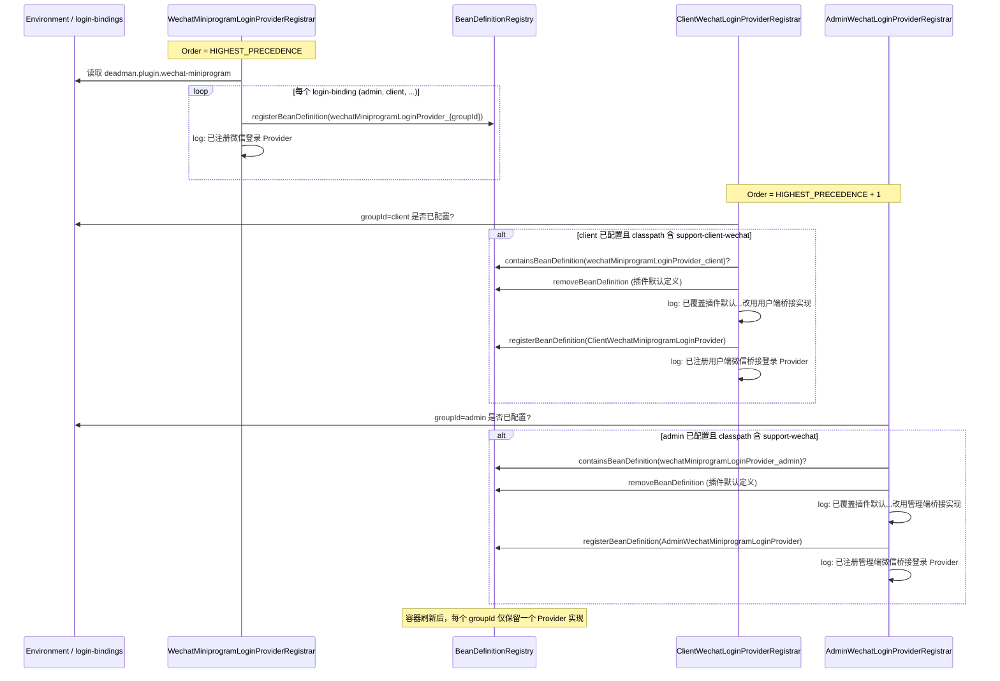

# 微信小程序登录 Provider 注册与覆盖机制

本文档说明 `deadman-app` 启动时，微信小程序登录 Provider 的**两阶段 Bean 注册**流程，以及日志中「已覆盖插件默认微信登录 Provider」的含义。

**相关文档**：

- 用户端桥接能力：[ClientWechatAuth.md](../deadman-support-client-wechat/ClientWechatAuth.md)
- Support 目录总览：[support/README.md](../../support/README.md)

---

## 1. 背景

`deadman-plugin-wechat` 提供通用的微信小程序 API 与 `LoginProvider` 框架，**不依赖**管理端（`user_base`）或用户端（`client_user_*`）用户表。

实际登录时，各用户体系需要不同的行为，例如：

| 用户体系 | 桥接模块 | 典型差异 |
|----------|----------|----------|
| 管理端 `admin` | `deadman-support-wechat` | 未绑定 openid 时返回 `bindToken`，不自动创建用户 |
| 用户端 `client` | `deadman-support-client-wechat` | 同上，且支持绑定注册 |

因此采用 **插件先注册通用实现 → Support 模块覆盖为桥接实现** 的模式，既保持插件无业务耦合，又能在 app 组装时注入域内逻辑。

---

## 2. 参与组件

| 阶段 | 类 | 模块 | `@Order` | 注册的 Bean |
|------|-----|------|----------|-------------|
| ① 插件默认 | `WechatMiniprogramLoginProviderRegistrar` | `deadman-plugin-wechat` | `HIGHEST_PRECEDENCE` | `ConfiguredWechatMiniprogramLoginProvider` |
| ② 管理端覆盖 | `AdminWechatLoginProviderRegistrar` | `deadman-support-wechat` | `HIGHEST_PRECEDENCE + 1` | `AdminWechatMiniprogramLoginProvider` |
| ② 用户端覆盖 | `ClientWechatLoginProviderRegistrar` | `deadman-support-client-wechat` | `HIGHEST_PRECEDENCE + 1` | `ClientWechatMiniprogramLoginProvider` |

Bean 命名规则统一为：

```
wechatMiniprogramLoginProvider_{groupId}
```

例如：`wechatMiniprogramLoginProvider_admin`、`wechatMiniprogramLoginProvider_client`。

配置来源：`deadman.plugin.wechat-miniprogram.login-bindings[].group-id`。只有出现在该列表中的 `groupId` 才会被插件注册；Support 模块 additionally 检查是否包含本域的 `groupId`，未配置则跳过覆盖。

---

## 3. 启动顺序图

以下时序发生在 Spring 容器 **BeanDefinition 注册阶段**（应用尚未完成启动，尚无运行时 Bean 实例）。



---

## 4. 典型启动日志解读

当 `deadman-app` 同时引入微信插件与 admin/client 两个 Support 模块，且 `login-bindings` 包含 `admin` 与 `client` 时，日志类似：

```
已注册微信登录 Provider：groupId=admin beanName=wechatMiniprogramLoginProvider_admin
已注册微信登录 Provider：groupId=client beanName=wechatMiniprogramLoginProvider_client
已覆盖插件默认微信登录 Provider，改用用户端桥接实现：wechatMiniprogramLoginProvider_client
已注册用户端微信桥接登录 Provider：groupId=client beanName=wechatMiniprogramLoginProvider_client
已覆盖插件默认微信登录 Provider，改用管理端桥接实现：wechatMiniprogramLoginProvider_admin
已注册管理端微信桥接登录 Provider：groupId=admin beanName=wechatMiniprogramLoginProvider_admin
```

| 日志 | 含义 |
|------|------|
| `已注册微信登录 Provider` | 插件按 `login-bindings` 注册了**通用** `ConfiguredWechatMiniprogramLoginProvider` |
| `已覆盖插件默认微信登录 Provider，改用…桥接实现` | Support 模块在 Bean 定义层**替换**同名 Bean（非运行时卸载） |
| `已注册…桥接登录 Provider` | 最终生效的是域内桥接实现 |

**这是预期行为，不是错误或警告。**

若仅引入插件、未引入对应 Support 模块，则插件默认实现会保留，不会被覆盖。

---

## 5. 覆盖实现细节

Support 模块通过 `BeanDefinitionRegistryPostProcessor` 在注册表阶段操作：

```java
String beanName = "wechatMiniprogramLoginProvider_" + groupId;
if (registry.containsBeanDefinition(beanName)) {
    registry.removeBeanDefinition(beanName);
    log.info("已覆盖插件默认微信登录 Provider，改用…桥接实现：{}", beanName);
}
registry.registerBeanDefinition(beanName, bridgeProviderDefinition);
```

要点：

1. **操作对象是 BeanDefinition**，发生在容器启动早期，不是删除已实例化的 Spring Bean。
2. **同名覆盖**：最终容器中每个 `groupId` 只有一个 `LoginProvider` Bean。
3. **Order 保证顺序**：插件 `HIGHEST_PRECEDENCE` 先跑，Support `+ 1` 后跑，确保 `containsBeanDefinition` 为 true 时可安全覆盖。
4. **AutoConfiguration 顺序**：`DeadmanClientWechatSupportAutoConfiguration` 声明 `after = DeadmanWechatPluginAutoConfiguration`，与上述 Order 策略一致。

---

## 6. 最终容器状态（deadman-app 全量组装）

```
wechatMiniprogramLoginProvider_admin  → AdminWechatMiniprogramLoginProvider
wechatMiniprogramLoginProvider_client → ClientWechatMiniprogramLoginProvider
```

`LoginProviderGroupManager` 按 `groupId` 聚合各 Provider，微信登录请求路由到对应桥接实现，再调用各自用户表与 OAuth 绑定逻辑。

---

## 7. 配置示例

```yaml
deadman:
  plugin:
    wechat-miniprogram:
      enabled: true
      app-id: ${DEADMAN_WECHAT_MINIPROGRAM_APP_ID}
      app-secret: ${DEADMAN_WECHAT_MINIPROGRAM_APP_SECRET}
      login-bindings:
        - group-id: admin   # 需 deadman-support-wechat 才会被桥接覆盖
        - group-id: client  # 需 deadman-support-client-wechat 才会被桥接覆盖
  support:
    wechat:
      enabled: true
    client-wechat:
      enabled: true
```

若 `login-bindings` 未包含某 `groupId`，对应 Support 模块会打日志并跳过，例如：

```
微信 login-bindings 未包含 client 组，跳过用户端微信桥接 Provider 注册
```

---

## 8. 源码索引

| 路径 | 说明 |
|------|------|
| `plugins/deadman-plugin-wechat/.../WechatMiniprogramLoginProviderRegistrar.java` | 插件默认 Provider 注册 |
| `plugins/deadman-plugin-wechat/.../ConfiguredWechatMiniprogramLoginProvider.java` | 插件通用实现（可被覆盖） |
| `support/deadman-support-wechat/.../AdminWechatLoginProviderRegistrar.java` | 管理端覆盖注册 |
| `support/deadman-support-wechat/.../AdminWechatMiniprogramLoginProvider.java` | 管理端桥接登录 |
| `support/deadman-support-client-wechat/.../ClientWechatLoginProviderRegistrar.java` | 用户端覆盖注册 |
| `support/deadman-support-client-wechat/.../ClientWechatMiniprogramLoginProvider.java` | 用户端桥接登录 |
| `deadman-security/.../LoginProviderGroupManager.java` | 按 groupId 聚合 LoginProvider |

---

## 9. 设计动机小结

```
deadman-plugin-wechat          通用能力，零 user 表依赖
        ↓ login-bindings 动态注册
ConfiguredWechatMiniprogramLoginProvider（占位 / 仅插件场景）
        ↓ Support 覆盖（BeanDefinition 层）
AdminWechatMiniprogramLoginProvider / ClientWechatMiniprogramLoginProvider
        ↓
各自 user 表 + bindToken + OAuth 绑定策略
```

这样既满足「插件可独立复用」，又满足「多用户体系在同一 app 内共存」的组装需求。
