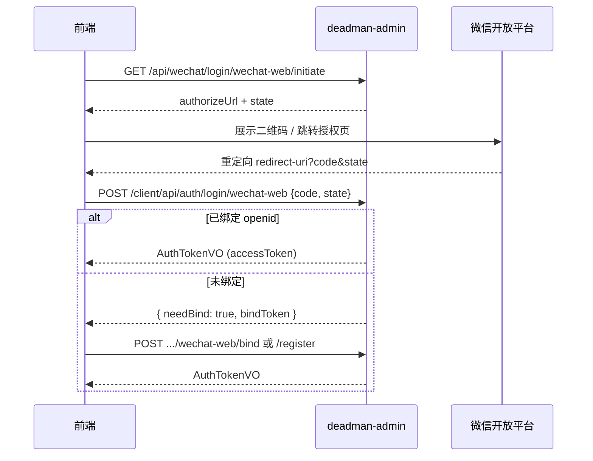

# 微信网页扫码登录

本文档介绍 `deadman-plugin-wechat` 中的 **微信开放平台网站应用扫码登录**（`wechat-web`）能力：模块定位、装配方式、统一公开 API 与登录流程。

**相关文档**：

| 用户体系 | 后端 | 前端对接 |
|----------|------|----------|
| 用户端 client | [ClientWechatWebAuth.md](../deadman-support-client-wechat/ClientWechatWebAuth.md) | [ClientWechatWebAuth-Frontend.md](../deadman-support-client-wechat/ClientWechatWebAuth-Frontend.md) |
| 管理端 admin | [AdminWechatWebAuth.md](../deadman-support-wechat/AdminWechatWebAuth.md) | [AdminWechatWebAuth-Frontend.md](../deadman-support-wechat/AdminWechatWebAuth-Frontend.md) |

- 微信登录统一公开 API：[WechatLogin.yaml](./WechatLogin.yaml)
- LoginProvider 注册机制：[WechatLoginProviderRegistration.md](./WechatLoginProviderRegistration.md)

---

## 1. 概述

### 1.1 是什么

微信网页扫码登录面向 **PC / 移动浏览器**，用户在微信中扫码确认后，前端获得授权 `code`，后端换取 `openid` 并完成 OAuth 登录或账号绑定。

与微信小程序登录（`wechat-miniprogram`）的关键差异：

| 维度 | 网页扫码 `wechat-web` | 小程序 `wechat-miniprogram` |
|------|----------------------|----------------------------|
| 平台 | 微信开放平台 · **网站应用** | 微信公众平台 · **小程序** |
| 凭证 | 开放平台 AppId / AppSecret | 小程序 AppId / AppSecret |
| 前端取 code | 扫码授权页重定向 | `wx.login()` |
| 额外参数 | 需要 `state`（防 CSRF） | 仅 `code` |
| OAuth 提供商 | `wechat-web` | `wechat-miniprogram` |
| 用户资料 | 可获取昵称、头像 | 默认无（需额外接口） |

两种方式在账号表中 **独立存储**，同一用户可分别绑定。

### 1.2 设计原则

- **插件无业务表依赖**：`deadman-plugin-wechat` 只调用微信 API、提供 `LoginProvider` 与统一门面 `WechatLoginService`
- **与小程序平行分包**：`web/` 与 `miniprogram/` 互不耦合，共享 `login/` 统一规范
- **用户体系由 support 桥接**：未绑定 openid 时返回 `bindToken`，不自动创建用户（与小程序一致）

---

## 2. 模块结构

```
deadman-plugin-wechat/
├── login/                              # 统一公开规范（小程序 + 网页共用）
│   ├── WechatLoginService              # Java 门面入口
│   ├── credential/                     # 请求模板
│   ├── session/                        # 响应模板
│   ├── initiate/                       # 预发起模板（网页扫码）
│   └── controller/WechatLoginController  # HTTP 公开 API
└── web/                                # 网页扫码专属实现
    ├── client/                         # OAuth2 / userinfo API 客户端
    ├── auth/                           # LoginProvider + 插件默认认证
    └── service/                        # state 存储、授权 URL 生成
```

引入 `deadman-support-client-wechat` / `deadman-support-wechat` 后，会覆盖插件默认 Provider，注入各用户体系的绑定策略。

---

## 3. 统一公开 API

### 3.1 Java 门面：`WechatLoginService`

其他模块应通过此服务调用微信登录，**不要**直接注入 `WechatWebApiClient`。

```java
@Autowired WechatLoginService wechatLoginService;

// 解析凭证 → 标准会话模板
WechatLoginSession session = wechatLoginService.resolve(
    new WechatWebLoginCredential(code, state));

// 预发起扫码（仅 wechat-web）
WechatLoginInitiateResult init = wechatLoginService.initiate(WechatLoginKinds.WEB);
```

### 3.2 标准模板对象

**请求凭证**（`WechatLoginCredential`）：

| 类型 | loginKind | 字段 |
|------|-----------|------|
| `WechatWebLoginCredential` | `wechat-web` | `code`, `state` |

**会话响应**（`WechatLoginSession`）公共字段：

| 字段 | 说明 |
|------|------|
| `loginKind` | `wechat-web` |
| `oauthProvider` | 写入 OAuth 账号表的提供商 |
| `openid` | 微信用户唯一标识 |
| `unionid` | 开放平台统一标识（可能为空） |
| `nickname` | 昵称 |
| `avatarUrl` | 头像 URL |

**网页扩展**（`WechatWebLoginSession`）：

| 字段 | 说明 |
|------|------|
| `accessToken` | 网页授权 access_token（绑定流程不持久化） |

**预发起响应**（`WechatWebLoginInitiateResult`）：

| 字段 | 说明 |
|------|------|
| `authorizeUrl` | 微信扫码授权页 URL |
| `state` | OAuth state，登录时原样回传 |
| `stateExpiresInSeconds` | state 有效秒数 |

### 3.3 HTTP 公开接口

根路径：`/api/wechat/login`（详见 [WechatLogin.yaml](./WechatLogin.yaml)）

| 方法 | 路径 | 说明 |
|------|------|------|
| GET | `/api/wechat/login/kinds` | 列出已启用的登录方式 |
| GET | `/api/wechat/login/wechat-web/initiate` | 获取扫码授权 URL 与 state |
| POST | `/api/wechat/login/sessions` | 解析凭证为 `WechatWebLoginSession`（调试用，业务登录走 JWT 接口） |

> 兼容旧路径：`GET /api/wechat-web/authorize-url`（已废弃，委托统一门面）。

---

## 4. 业务登录接口

插件只负责身份解析；**签发 JWT** 由各用户体系 `LoginProvider` 完成：

| 用户体系 | 登录 | 绑定已有账号 | 绑定注册 |
|----------|------|-------------|----------|
| 用户端 client | `POST /client/api/auth/login/wechat-web` | `POST /client/api/auth/wechat-web/bind` | `POST /client/api/auth/wechat-web/register` |
| 管理端 admin | `POST /api/auth/login/wechat-web` | `POST /api/auth/wechat-web/bind` | 不支持 |

登录请求体：

```json
{
  "code": "微信授权 code",
  "state": "initiate 返回的 state"
}
```

---

## 5. 配置

```yaml
deadman:
  plugin:
    wechat-web:
      enabled: true
      app-id: ${DEADMAN_WECHAT_WEB_APP_ID}
      app-secret: ${DEADMAN_WECHAT_WEB_APP_SECRET}
      redirect-uri: ${DEADMAN_WECHAT_WEB_REDIRECT_URI}   # 须与开放平台一致
      state-ttl: 5m
      login-bindings:
        - group-id: client
        - group-id: admin
  support:
    client-wechat:
      enabled: true
      bind-token-ttl: 10m
    wechat:
      enabled: true
      bind-token-ttl: 10m
```

| 配置项 | 环境变量 | 说明 |
|--------|----------|------|
| `deadman.plugin.wechat-web.enabled` | `DEADMAN_PLUGIN_WECHAT_WEB_ENABLED` | 总开关，默认 `false` |
| `app-id` / `app-secret` | `DEADMAN_WECHAT_WEB_APP_ID` / `SECRET` | 开放平台网站应用凭证 |
| `redirect-uri` | `DEADMAN_WECHAT_WEB_REDIRECT_URI` | 授权回调地址 |
| `state-ttl` | `DEADMAN_WECHAT_WEB_STATE_TTL` | state 有效期，默认 5 分钟 |
| `login-bindings[].group-id` | — | 须含目标用户体系（`client` / `admin`） |

### 5.1 微信开放平台配置要点

1. 创建 **网站应用**，获取 AppId / AppSecret
2. 配置 **授权回调域**（只需域名，如 `your-site.com`）
3. `redirect-uri` 填写完整回调 URL，例如 `https://your-site.com/auth/wechat/callback`
4. 回调 URL 必须与开放平台备案域名一致

---

## 6. 完整登录时序



---

## 7. Provider 注册

与小程序相同的两阶段模式（详见 [WechatLoginProviderRegistration.md](./WechatLoginProviderRegistration.md)）：

| 阶段 | Bean 名 | 实现 |
|------|---------|------|
| ① 插件默认 | `wechatWebLoginProvider_{groupId}` | `ConfiguredWechatWebLoginProvider` |
| ② support 覆盖 | 同名替换 | `ClientWechatWebLoginProvider` / `AdminWechatWebLoginProvider` |

额外 Provider（仅 support 注册）：

| providerId | 端点 |
|------------|------|
| `wechat-web-bind` | `.../wechat-web/bind` |
| `wechat-web-register` | `.../wechat-web/register`（仅 client） |

---

## 8. Maven 依赖（deadman-app 组装示例）

```xml
<dependency>
    <groupId>com.mtfm</groupId>
    <artifactId>deadman-plugin-wechat</artifactId>
</dependency>
<!-- 用户端 -->
<dependency>
    <groupId>com.mtfm</groupId>
    <artifactId>deadman-component-client</artifactId>
</dependency>
<dependency>
    <groupId>com.mtfm</groupId>
    <artifactId>deadman-support-client-wechat</artifactId>
</dependency>
<!-- 管理端 -->
<dependency>
    <groupId>com.mtfm</groupId>
    <artifactId>deadman-support-wechat</artifactId>
</dependency>
```

---

## 9. 源码索引

| 路径 | 说明 |
|------|------|
| `plugins/.../login/WechatLoginService.java` | 统一公开门面 |
| `plugins/.../login/resolver/WebWechatLoginResolver.java` | 网页凭证解析 |
| `plugins/.../web/auth/ConfiguredWechatWebLoginProvider.java` | 插件默认登录 Provider |
| `support/deadman-support-client-wechat/.../ClientWechatWebAuthService.java` | 用户端桥接业务 |
| `support/deadman-support-wechat/.../AdminWechatWebAuthService.java` | 管理端桥接业务 |
