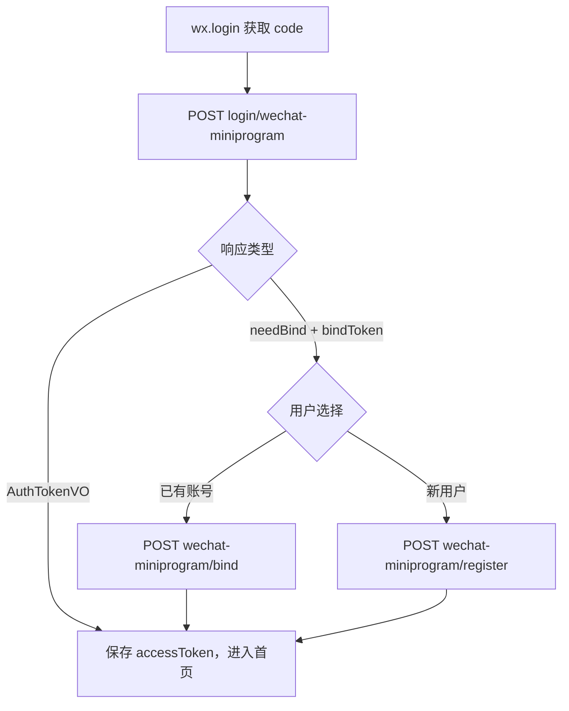

# 用户端微信小程序登录 — 前端对接指南

本文档面向小程序 / H5 前端，说明如何对接 **用户端（CLIENT）** 微信小程序 OAuth 登录、账号绑定、绑定注册与手机号绑定。

后端机制详见：[ClientWechatAuth.md](./ClientWechatAuth.md)

JWT 刷新与 Cookie 约定详见：[JwtTokenRefresh-Frontend.md](../deadman-security/JwtTokenRefresh-Frontend.md)

---

## 1. 对接前必读

### 1.1 仅适用于用户端 API

| 项目 | 值 |
|------|-----|
| API 前缀 | `/client/api/**` |
| 微信登录 | `POST /client/api/auth/login/wechat-miniprogram` |
| Access Token 存储 key（建议） | `client_access_token` |
| Refresh Cookie 名 | `deadman_client_refresh_token` |
| Refresh 路径 | `POST /client/api/auth/refresh` |

**不要**与管理端 Token（`/api/**`）混用。

### 1.2 与普通注册的区别

| 接口 | 是否绑定微信 | 是否返回 JWT |
|------|-------------|-------------|
| `POST /client/api/auth/register` | 否 | 否（仅 `userCode`、`nickname`） |
| `POST /client/api/auth/wechat-miniprogram/register` | 是（须 `bindToken`） | **是**（`AuthTokenVO`） |

微信未绑定场景下，请走 **绑定注册** 或 **绑定已有账号**，不要先调普通注册再期望自动关联微信。

### 1.3 请求必须带 credentials

登录、绑定、绑定注册、刷新接口需携带 Cookie：

```typescript
// fetch
fetch(url, { method: 'POST', credentials: 'include', ... })

// axios
axios.defaults.withCredentials = true
```

否则无法收到 Refresh HttpOnly Cookie，无感刷新将失效。

---

## 2. 对接清单（Checklist）

- [ ] 微信登录使用 `wx.login` 获取 **临时 code**（5 分钟有效，一次性）
- [ ] 判断响应：`needBind === true` 进入绑定/注册页，否则保存 `accessToken`
- [ ] 绑定/注册请求携带第一步返回的 **同一 `bindToken`**
- [ ] `bindToken` 过期或报错 `12032` 时，重新 `wx.login` 并从第一步重来
- [ ] 登录类请求开启 `withCredentials` / `credentials: 'include'`
- [ ] 业务请求附加 `Authorization: Bearer {client_access_token}`
- [ ] 401 拦截器排除登录/绑定/刷新路径，并实现 refresh 队列（见 JWT 前端文档）

---

## 3. 流程总览



---

## 4. 步骤一：微信登录

### 4.1 小程序侧获取 code

```javascript
wx.login({
  success(res) {
    if (res.code) {
      loginWithWechat(res.code)
    }
  }
})
```

### 4.2 调用后端

```http
POST /client/api/auth/login/wechat-miniprogram
Content-Type: application/json

{ "code": "081abcXYZ..." }
```

### 4.3 解析响应

**情况 A — 已绑定，直接登录成功**

```typescript
interface AuthTokenVO {
  accessToken: string
  refreshToken: string
  tokenType: 'Bearer'
  expiresIn: number
  refreshExpiresIn: number
  userCode: string
  nickname: string
}

// data 含 accessToken，且无 needBind
sessionStorage.setItem('client_access_token', data.accessToken)
// Refresh 由 Set-Cookie 自动写入，无需 JS 读取
```

**情况 B — 未绑定，需绑定或注册**

```typescript
interface ClientWechatPendingBindVO {
  bindToken: string
  expiresIn: number      // 有效秒数，默认 600
  needBind: true
}

// 保存 bindToken，跳转绑定/注册页（注意 expiresIn 倒计时）
sessionStorage.setItem('wechat_bind_token', data.bindToken)
sessionStorage.setItem('wechat_bind_expire_at', String(Date.now() + data.expiresIn * 1000))
```

判断逻辑示例：

```typescript
function isPendingBind(data: any): data is ClientWechatPendingBindVO {
  return data?.needBind === true && typeof data?.bindToken === 'string'
}

function isAuthToken(data: any): data is AuthTokenVO {
  return typeof data?.accessToken === 'string' && !data?.needBind
}
```

---

## 5. 步骤二 A：绑定已有账号

用户已有用户名密码，将微信 openid 关联到该账号。

```http
POST /client/api/auth/wechat-miniprogram/bind
Content-Type: application/json

{
  "bindToken": "a1b2c3d4e5f6789012345678901234ab",
  "username": "existing_user",
  "password": "your_password"
}
```

**成功**：响应 `AuthTokenVO`，处理方式同密码登录成功。

**失败（HTTP 200，业务码非 0）**：

| 场景 | 典型 code / msg |
|------|-----------------|
| 密码错误 | `40100` |
| bindToken 无效或已使用 | `12032` |
| 该微信已绑其他用户 | `12031` |

bindToken 失效时：**重新 `wx.login` → 步骤一**，不要复用旧 bindToken。

---

## 6. 步骤二 B：注册新账号并绑定

新用户在微信授权后一步完成注册 + openid 绑定 + 登录。

```http
POST /client/api/auth/wechat-miniprogram/register
Content-Type: application/json

{
  "bindToken": "a1b2c3d4e5f6789012345678901234ab",
  "username": "new_user",
  "password": "password123",
  "nickname": "可选昵称"
}
```

| 字段 | 必填 | 说明 |
|------|------|------|
| `bindToken` | 是 | 步骤一返回，一次性 |
| `username` | 是 | 3–64 字符 |
| `password` | 是 | 8–64 字符 |
| `nickname` | 否 | 为空则使用 username |

**成功**：响应 `AuthTokenVO`（**无需**再调普通注册或密码登录）。

**失败**：

| 场景 | 典型 code |
|------|-----------|
| 用户名已存在 | `10003` |
| bindToken 无效 | `12032` |

---

## 7. 完整 TypeScript 示例

```typescript
const API_BASE = 'https://your-api.com'

async function wechatLoginFlow() {
  const code = await getWxLoginCode()
  const loginRes = await postJson('/client/api/auth/login/wechat-miniprogram', { code })

  if (loginRes.code !== 0) {
    throw new Error(loginRes.msg)
  }

  const { data } = loginRes

  if (isPendingBind(data)) {
    // 跳转绑定页，把 bindToken 传入下一页
    navigateToBindPage({ bindToken: data.bindToken, expiresIn: data.expiresIn })
    return
  }

  if (isAuthToken(data)) {
    saveClientTokens(data)
    navigateToHome()
  }
}

async function bindExistingAccount(bindToken: string, username: string, password: string) {
  const res = await postJson('/client/api/auth/wechat-miniprogram/bind', {
    bindToken,
    username,
    password,
  })
  if (res.code !== 0) throw new Error(res.msg)
  saveClientTokens(res.data)
  navigateToHome()
}

async function registerAndBind(
  bindToken: string,
  username: string,
  password: string,
  nickname?: string,
) {
  const res = await postJson('/client/api/auth/wechat-miniprogram/register', {
    bindToken,
    username,
    password,
    nickname,
  })
  if (res.code !== 0) throw new Error(res.msg)
  saveClientTokens(res.data)
  navigateToHome()
}

function postJson(path: string, body: unknown) {
  return fetch(`${API_BASE}${path}`, {
    method: 'POST',
    credentials: 'include',
    headers: { 'Content-Type': 'application/json' },
    body: JSON.stringify(body),
  }).then(r => r.json())
}

function saveClientTokens(data: AuthTokenVO) {
  sessionStorage.setItem('client_access_token', data.accessToken)
  sessionStorage.setItem(
    'client_access_expire_at',
    String(Date.now() + data.expiresIn * 1000),
  )
}
```

---

## 8. 绑定页 UI 建议

未绑定时展示两个入口（或 Tab）：

1. **已有账号** → 用户名 + 密码 → 调用 `.../bind`
2. **新用户注册** → 用户名 + 密码 + 昵称 → 调用 `.../register`

共用同一个 `bindToken`，并在 UI 上展示过期倒计时（`expiresIn`）。过期后提示用户「授权已失效，请重新微信登录」并回到步骤一。

**禁止**：

- 在 bindToken 过期后继续提交
- 对同一 bindToken 同时调用 bind 和 register（只能成功一次）
- 先调 `/client/api/auth/register` 再手动绑微信（后端不支持）

---

## 9. 已登录：绑定微信手机号（可选）

需先完成微信登录并持有 Access Token。

```http
POST /client/api/wechat-miniprogram/phone/bind
Authorization: Bearer {client_access_token}
Content-Type: application/json

{ "code": "getPhoneNumber返回的code" }
```

成功 `data`：

```json
{ "phone": "13800138000" }
```

小程序按钮示例：

```html
<button open-type="getPhoneNumber" bindgetphonenumber="onGetPhoneNumber">
  绑定手机号
</button>
```

```javascript
async onGetPhoneNumber(e) {
  if (e.detail.code) {
    await request({
      url: '/client/api/wechat-miniprogram/phone/bind',
      method: 'POST',
      header: { Authorization: 'Bearer ' + getAccessToken() },
      data: { code: e.detail.code },
    })
  }
}
```

---

## 10. 错误处理速查

| code | 含义 | 前端建议 |
|------|------|----------|
| `0` | 成功 | — |
| `10003` | 用户名已存在 | 注册页提示更换用户名 |
| `12031` | 微信已被其他账号绑定 | 提示联系客服或换微信 |
| `12032` | bindToken 无效/过期 | 重新 `wx.login` + 步骤一 |
| `40100` | 认证失败 | 密码错误等，允许重试（bindToken 未消费时） |

登录/绑定接口 HTTP 状态码通常为 **200**，请以响应体 `code` 为准。

---

## 11. 与管理端微信登录的区别

| 项目 | 用户端（本文档） | 管理端 |
|------|-----------------|--------|
| 登录路径 | `/client/api/auth/login/wechat-miniprogram` | `/api/auth/wechat-miniprogram` |
| 绑定路径 | `/client/api/auth/wechat-miniprogram/bind` | `/api/auth/wechat-miniprogram/bind` |
| 绑定注册 | **有** `.../wechat-miniprogram/register` | **无** |
| Token / Cookie | CLIENT 独立 | ADMIN 独立 |

同一小程序 AppId 可同时配置 `login-bindings: [client, admin]`，但前端须根据业务场景调用对应前缀接口。

---

## 12. 相关文档

| 文档 | 说明 |
|------|------|
| [ClientWechatAuth.md](./ClientWechatAuth.md) | 后端机制与配置 |
| [JwtTokenRefresh-Frontend.md](../deadman-security/JwtTokenRefresh-Frontend.md) | Access/Refresh 无感刷新 |
| [ClientAuthController.yaml](../deadman-component-client/ClientAuthController.yaml) | 用户端密码登录 OpenAPI |
| [WechatMiniprogramController.yaml](../deadman-plugin-wechat/WechatMiniprogramController.yaml) | 手机号绑定 OpenAPI |
