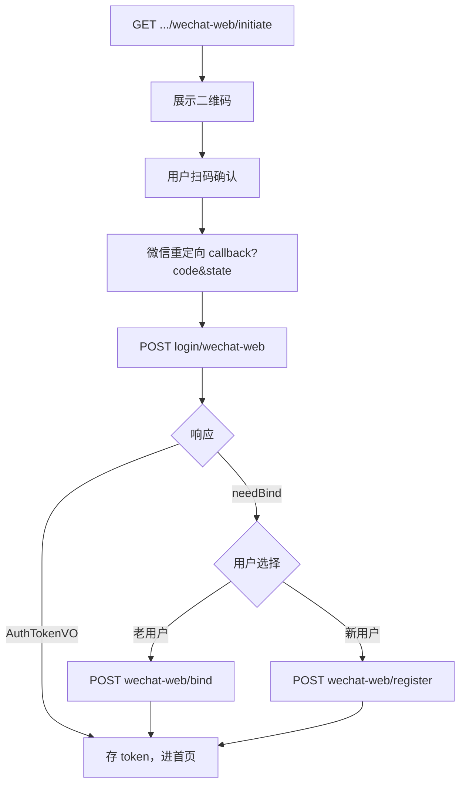

# 用户端微信网页扫码登录 — 前端对接指南

本文档面向 **Web 前端**，说明如何对接用户端（CLIENT）微信开放平台网站应用扫码登录、账号绑定与绑定注册。

**后端说明**：[ClientWechatWebAuth.md](./ClientWechatWebAuth.md) · [WechatWebLogin.md](../deadman-plugin-wechat/WechatWebLogin.md)

**管理端对接**：[AdminWechatWebAuth-Frontend.md](../deadman-support-wechat/AdminWechatWebAuth-Frontend.md)

**JWT 刷新与 Cookie**：[JwtTokenRefresh-Frontend.md](../deadman-security/JwtTokenRefresh-Frontend.md)

---

## 1. 对接前必读

### 1.1 接口一览

| 项目 | 值 |
|------|-----|
| 用户端 API 前缀 | `/client/api/**` |
| 插件公开 API | `/api/wechat/login/**`（非 client 前缀） |
| 获取扫码授权 | `GET /api/wechat/login/wechat-web/initiate` |
| 微信登录 | `POST /client/api/auth/login/wechat-web` |
| 绑定已有账号 | `POST /client/api/auth/wechat-web/bind` |
| 绑定注册 | `POST /client/api/auth/wechat-web/register` |
| OAuth 提供商 | `wechat-web`（与小程序 `wechat-miniprogram` 独立） |
| Access Token 建议 key | `client_access_token` |
| Refresh Cookie | `deadman_client_refresh_token` |
| Refresh 接口 | `POST /client/api/auth/refresh` |

**不要**与管理端 Token（`/api/**`）混用。

### 1.2 开放平台前置条件

1. 在微信开放平台创建 **网站应用**，获取 AppId / AppSecret
2. 配置 **授权回调域**（仅域名，如 `www.example.com`）
3. 后端 `redirect-uri` 配置为前端回调页完整 URL，例如：
   `https://www.example.com/auth/wechat/callback`
4. 后端启用 `deadman.plugin.wechat-web.enabled=true`，且 `login-bindings` 含 `client`

### 1.3 与普通注册的区别

| 接口 | 是否绑定微信 | 是否返回 JWT |
|------|-------------|-------------|
| `POST /client/api/auth/register` | 否 | 否 |
| `POST /client/api/auth/wechat-web/register` | 是（须 `bindToken`） | **是** |

微信未绑定场景请走 **绑定** 或 **绑定注册**，不要先普通注册再期望自动关联微信。

### 1.4 必须携带 Cookie

登录、绑定、注册、刷新接口需：

```typescript
fetch(url, { method: 'POST', credentials: 'include' })
// axios: axios.defaults.withCredentials = true
```

---

## 2. 对接清单（Checklist）

- [ ] 登录页调用 `GET /api/wechat/login/wechat-web/initiate` 获取 `authorizeUrl` 与 `state`
- [ ] 展示二维码或跳转授权页；`redirect-uri` 路由能解析 `code` 与 `state`
- [ ] 回调后立刻 `POST /client/api/auth/login/wechat-web`（`code` 一次性有效）
- [ ] 判断响应：`needBind === true` 进绑定页，否则保存 `accessToken`
- [ ] 绑定/注册携带**同一** `bindToken`；过期（错误码 `12032`）则重新扫码
- [ ] 登录类请求 `credentials: 'include'`
- [ ] 业务请求带 `Authorization: Bearer {client_access_token}`
- [ ] 401 拦截器排除登录/绑定/刷新路径（见 JWT 前端文档）

---

## 3. 流程总览



---

## 4. 类型定义（TypeScript 参考）

```typescript
/** 统一 Result 包装 */
interface Result<T> {
  code: number
  message: string
  data: T
}

/** initiate 响应：WechatWebLoginInitiateResult */
interface WechatWebInitiateVO {
  loginKind: 'wechat-web'
  authorizeUrl: string
  state: string
  stateExpiresInSeconds: number
}

/** 登录成功 */
interface AuthTokenVO {
  accessToken: string
  tokenType: 'Bearer'
  expiresIn: number
}

/** 待绑定 */
interface WechatPendingBindVO {
  bindToken: string
  expiresIn: number
  needBind: true
}

type WechatWebLoginResult = AuthTokenVO | WechatPendingBindVO

function isPendingBind(data: WechatWebLoginResult): data is WechatPendingBindVO {
  return 'needBind' in data && data.needBind === true
}
```

---

## 5. 步骤一：获取扫码授权地址

### 请求

```http
GET /api/wechat/login/wechat-web/initiate
```

### 响应

```json
{
  "code": 0,
  "message": "success",
  "data": {
    "loginKind": "wechat-web",
    "authorizeUrl": "https://open.weixin.qq.com/connect/qrconnect?appid=...#wechat_redirect",
    "state": "a1b2c3d4e5f6...",
    "stateExpiresInSeconds": 300
  }
}
```

### 展示方式

| 方式 | 说明 |
|------|------|
| iframe / 新窗口打开 `authorizeUrl` | 最快，微信页自带二维码 |
| 用 QR 库将 `authorizeUrl` 转图片 | 须保留完整 URL（含 `#wechat_redirect`） |

---

## 6. 步骤二：授权回调页

在 `redirect-uri` 对应路由（如 `/auth/wechat/callback`）解析参数：

```typescript
const params = new URLSearchParams(window.location.search)
const code = params.get('code')
const state = params.get('state')
```

微信授权失败时可能带 `error`、`error_description`，需做错误提示。

---

## 7. 步骤三：微信登录

### 请求

```http
POST /client/api/auth/login/wechat-web
Content-Type: application/json

{
  "code": "081abc...",
  "state": "a1b2c3d4e5f6..."
}
```

### 已绑定 — JWT

```json
{
  "code": 0,
  "data": {
    "accessToken": "eyJ...",
    "tokenType": "Bearer",
    "expiresIn": 3600
  }
}
```

### 未绑定 — bindToken

```json
{
  "code": 0,
  "data": {
    "bindToken": "f7e8d9c0...",
    "expiresIn": 600,
    "needBind": true
  }
}
```

---

## 8. 步骤四：绑定或注册

### 绑定已有账号

```http
POST /client/api/auth/wechat-web/bind
Content-Type: application/json

{
  "bindToken": "f7e8d9c0...",
  "username": "existing_user",
  "password": "your-password"
}
```

### 绑定注册新账号

```http
POST /client/api/auth/wechat-web/register
Content-Type: application/json

{
  "bindToken": "f7e8d9c0...",
  "username": "new_user",
  "password": "your-password",
  "nickname": "可选，不传则用微信昵称"
}
```

成功均返回 `AuthTokenVO`。

---

## 9. 完整示例（React）

### 9.1 登录页二维码

```tsx
// components/WechatQrLogin.tsx
import { useEffect, useState } from 'react'
import QRCode from 'qrcode'

export function WechatQrLogin() {
  const [qrDataUrl, setQrDataUrl] = useState<string>()
  const [error, setError] = useState<string>()

  useEffect(() => {
    fetch('/api/wechat/login/wechat-web/initiate')
      .then((r) => r.json())
      .then(async (json) => {
        if (json.code !== 0) throw new Error(json.message)
        const url = json.data.authorizeUrl as string
        setQrDataUrl(await QRCode.toDataURL(url, { width: 220, margin: 1 }))
      })
      .catch((e) => setError(e.message ?? '加载失败'))
  }, [])

  if (error) return <p>微信登录不可用：{error}</p>
  if (!qrDataUrl) return <p>加载二维码...</p>
  return (
    <div>
      
      <p>请使用微信扫描二维码登录</p>
    </div>
  )
}
```

### 9.2 授权回调页

```tsx
// pages/auth/wechat-callback.tsx
import { useEffect, useRef } from 'react'
import { useNavigate, useSearchParams } from 'react-router-dom'

export default function WechatCallbackPage() {
  const [search] = useSearchParams()
  const navigate = useNavigate()
  const called = useRef(false)

  useEffect(() => {
    if (called.current) return
    called.current = true

    const code = search.get('code')
    const state = search.get('state')
    const wxError = search.get('error')

    if (wxError) {
      navigate('/login?error=wechat_denied')
      return
    }
    if (!code || !state) {
      navigate('/login?error=wechat_missing_params')
      return
    }

    fetch('/client/api/auth/login/wechat-web', {
      method: 'POST',
      credentials: 'include',
      headers: { 'Content-Type': 'application/json' },
      body: JSON.stringify({ code, state }),
    })
      .then((r) => r.json())
      .then((json) => {
        if (json.code !== 0) throw new Error(json.message)
        const data = json.data
        if (data.needBind) {
          navigate('/login/wechat-bind', {
            state: { bindToken: data.bindToken, expiresIn: data.expiresIn },
          })
          return
        }
        localStorage.setItem('client_access_token', data.accessToken)
        navigate('/')
      })
      .catch(() => navigate('/login?error=wechat_login_failed'))
  }, [search, navigate])

  return <p>微信登录处理中...</p>
}
```

### 9.3 封装 API（可选）

```typescript
// lib/wechat-web-auth.ts
const CLIENT_AUTH = '/client/api/auth'
const PLUGIN_LOGIN = '/api/wechat/login'

export async function fetchWechatWebInitiate() {
  const res = await fetch(`${PLUGIN_LOGIN}/wechat-web/initiate`)
  const json = await res.json()
  if (json.code !== 0) throw new Error(json.message)
  return json.data as WechatWebInitiateVO
}

export async function loginByWechatWeb(code: string, state: string) {
  const res = await fetch(`${CLIENT_AUTH}/login/wechat-web`, {
    method: 'POST',
    credentials: 'include',
    headers: { 'Content-Type': 'application/json' },
    body: JSON.stringify({ code, state }),
  })
  const json = await res.json()
  if (json.code !== 0) throw new Error(json.message)
  return json.data as WechatWebLoginResult
}
```

---

## 10. 常见错误

| 场景 | 现象 | 处理 |
|------|------|------|
| state 过期 | 登录报 state 无效 | 重新 `initiate` |
| bindToken 过期 | `code: 12032` | 重新扫码全流程 |
| 扫码后无回调 | 页面不跳转 | 检查开放平台回调域与 `redirect-uri` 是否一致 |
| 用了管理端 token | 401 / 403 | 仅用 `/client/api/**` 与 client JWT |
| 重复提交回调 | 第二次 code 失效 | 回调页用 `useRef` 防重复请求 |

---

## 11. 管理端文档

管理端网页扫码（无绑定注册）见：[AdminWechatWebAuth-Frontend.md](../deadman-support-wechat/AdminWechatWebAuth-Frontend.md)
