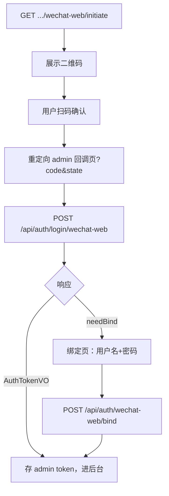

# 管理端微信网页扫码登录 — 前端对接指南

本文档面向 **管理后台 Web 前端**，说明如何对接管理端（ADMIN）微信开放平台网站应用扫码登录与账号绑定。

**后端说明**：[AdminWechatWebAuth.md](./AdminWechatWebAuth.md) · [WechatWebLogin.md](../deadman-plugin-wechat/WechatWebLogin.md)

**JWT 刷新与 Cookie**：[JwtTokenRefresh-Frontend.md](../deadman-security/JwtTokenRefresh-Frontend.md)

---

## 1. 对接前必读

### 1.1 接口一览

| 项目 | 值 |
|------|-----|
| 管理端 API 前缀 | `/api/**`（不含 `/client/api`） |
| 插件公开 API | `/api/wechat/login/**` |
| 获取扫码授权 | `GET /api/wechat/login/wechat-web/initiate` |
| 微信登录 | `POST /api/auth/login/wechat-web` |
| 绑定已有账号 | `POST /api/auth/wechat-web/bind` |
| OAuth 提供商 | `wechat-web` |
| Access Token 建议 key | `admin_access_token` |
| Refresh Cookie | `deadman_refresh_token` |
| Refresh 接口 | `POST /api/auth/refresh` |

**不要**与用户端 Token（`/client/api/**`）混用。

### 1.2 与用户端的关键差异

| 项目 | 管理端 | 用户端 |
|------|--------|--------|
| 绑定注册新账号 | **不支持** | 支持 `.../wechat-web/register` |
| 首次扫码未绑定 | 须绑定**已有**管理端账号 | 可绑定已有或注册新账号 |
| 典型场景 | 内部员工已有 admin 账号后绑定微信 | C 端用户自助注册 |

### 1.3 开放平台前置条件

1. 微信开放平台创建 **网站应用**（可与用户端共用同一应用，也可独立应用）
2. 配置授权回调域；`redirect-uri` 指向管理端登录回调页，例如：
   `https://admin.example.com/auth/wechat/callback`
3. 后端 `deadman.plugin.wechat-web.enabled=true`，`login-bindings` 含 `admin`

### 1.4 必须携带 Cookie

```typescript
fetch(url, { method: 'POST', credentials: 'include' })
```

---

## 2. 对接清单（Checklist）

- [ ] 登录页 `GET /api/wechat/login/wechat-web/initiate` 获取二维码
- [ ] 回调页解析 `code`、`state` 并调用 `POST /api/auth/login/wechat-web`
- [ ] `needBind === true` 时跳转绑定页（**仅**用户名+密码，无注册入口）
- [ ] 绑定请求 `POST /api/auth/wechat-web/bind` 携带同一 `bindToken`
- [ ] `bindToken` 过期（`12032`）则重新扫码
- [ ] 登录类请求 `credentials: 'include'`
- [ ] 业务请求 `Authorization: Bearer {admin_access_token}`

---

## 3. 流程总览



---

## 4. 类型定义（TypeScript 参考）

```typescript
interface Result<T> {
  code: number
  message: string
  data: T
}

interface WechatWebInitiateVO {
  loginKind: 'wechat-web'
  authorizeUrl: string
  state: string
  stateExpiresInSeconds: number
}

interface AuthTokenVO {
  accessToken: string
  tokenType: 'Bearer'
  expiresIn: number
}

interface WechatPendingBindVO {
  bindToken: string
  expiresIn: number
  needBind: true
}

type AdminWechatWebLoginResult = AuthTokenVO | WechatPendingBindVO

function isPendingBind(data: AdminWechatWebLoginResult): data is WechatPendingBindVO {
  return 'needBind' in data && data.needBind === true
}
```

---

## 5. 步骤一：获取扫码授权地址

```http
GET /api/wechat/login/wechat-web/initiate
```

```json
{
  "code": 0,
  "data": {
    "loginKind": "wechat-web",
    "authorizeUrl": "https://open.weixin.qq.com/connect/qrconnect?...",
    "state": "a1b2c3...",
    "stateExpiresInSeconds": 300
  }
}
```

与用户端共用同一插件接口；若 admin 与 client 使用不同 `redirect-uri`，需在开放平台分别配置或在后端按环境切换 `redirect-uri`（同一时刻仅一个生效）。

---

## 6. 步骤二：授权回调

管理端回调路由示例：`/auth/wechat/callback`

```typescript
const code = new URLSearchParams(location.search).get('code')
const state = new URLSearchParams(location.search).get('state')
```

---

## 7. 步骤三：微信登录

```http
POST /api/auth/login/wechat-web
Content-Type: application/json

{
  "code": "081abc...",
  "state": "a1b2c3..."
}
```

**已绑定** — 返回 `AuthTokenVO`，Cookie 写入 `deadman_refresh_token`。

**未绑定** — 返回 `{ needBind: true, bindToken, expiresIn }`，跳转绑定页。

---

## 8. 步骤四：绑定已有管理端账号

```http
POST /api/auth/wechat-web/bind
Content-Type: application/json

{
  "bindToken": "f7e8d9c0...",
  "username": "admin",
  "password": "your-password"
}
```

成功返回 `AuthTokenVO`。管理端**没有** `.../wechat-web/register` 接口。

---

## 9. 完整示例（React）

### 9.1 管理端登录页二维码

```tsx
// components/AdminWechatQrLogin.tsx
import { useEffect, useState } from 'react'
import QRCode from 'qrcode'

export function AdminWechatQrLogin() {
  const [qrDataUrl, setQrDataUrl] = useState<string>()

  useEffect(() => {
    fetch('/api/wechat/login/wechat-web/initiate')
      .then((r) => r.json())
      .then(async (json) => {
        if (json.code !== 0) throw new Error(json.message)
        setQrDataUrl(await QRCode.toDataURL(json.data.authorizeUrl, { width: 220 }))
      })
  }, [])

  if (!qrDataUrl) return <p>加载二维码...</p>
  return 
}
```

### 9.2 回调页

```tsx
// pages/auth/wechat-callback.tsx
import { useEffect, useRef } from 'react'
import { useNavigate, useSearchParams } from 'react-router-dom'

export default function AdminWechatCallbackPage() {
  const [search] = useSearchParams()
  const navigate = useNavigate()
  const called = useRef(false)

  useEffect(() => {
    if (called.current) return
    called.current = true

    const code = search.get('code')
    const state = search.get('state')
    if (!code || !state) {
      navigate('/login?error=wechat_missing_params')
      return
    }

    fetch('/api/auth/login/wechat-web', {
      method: 'POST',
      credentials: 'include',
      headers: { 'Content-Type': 'application/json' },
      body: JSON.stringify({ code, state }),
    })
      .then((r) => r.json())
      .then((json) => {
        if (json.code !== 0) throw new Error(json.message)
        const data = json.data
        if (data.needBind) {
          navigate('/login/wechat-bind', {
            state: { bindToken: data.bindToken, expiresIn: data.expiresIn },
          })
          return
        }
        localStorage.setItem('admin_access_token', data.accessToken)
        navigate('/dashboard')
      })
      .catch(() => navigate('/login?error=wechat_login_failed'))
  }, [search, navigate])

  return <p>微信登录处理中...</p>
}
```

### 9.3 绑定页

```tsx
// pages/login/wechat-bind.tsx
import { useLocation, useNavigate } from 'react-router-dom'
import { useState } from 'react'

export default function AdminWechatBindPage() {
  const navigate = useNavigate()
  const location = useLocation()
  const { bindToken } = (location.state as { bindToken: string }) ?? {}

  const [username, setUsername] = useState('')
  const [password, setPassword] = useState('')

  async function onSubmit(e: React.FormEvent) {
    e.preventDefault()
    if (!bindToken) {
      navigate('/login?error=bind_token_missing')
      return
    }
    const res = await fetch('/api/auth/wechat-web/bind', {
      method: 'POST',
      credentials: 'include',
      headers: { 'Content-Type': 'application/json' },
      body: JSON.stringify({ bindToken, username, password }),
    })
    const json = await res.json()
    if (json.code !== 0) {
      alert(json.message)
      return
    }
    localStorage.setItem('admin_access_token', json.data.accessToken)
    navigate('/dashboard')
  }

  return (
    <form onSubmit={onSubmit}>
      <h2>绑定已有管理端账号</h2>
      <p>微信首次登录需关联您的管理端账号，不支持在此注册新账号。</p>
      <input value={username} onChange={(e) => setUsername(e.target.value)} placeholder="用户名" />
      <input type="password" value={password} onChange={(e) => setPassword(e.target.value)} placeholder="密码" />
      <button type="submit">绑定并登录</button>
    </form>
  )
}
```

---

## 10. 常见错误

| 场景 | 处理 |
|------|------|
| state 过期 | 重新 `initiate` |
| bindToken 过期（12032） | 重新扫码 |
| 误调用户端接口 | 管理端只用 `/api/**`，不用 `/client/api/**` |
| 期望扫码自动注册 | 管理端不支持，须先由管理员创建账号 |

---

## 11. 用户端文档

C 端网页扫码（含绑定注册）见：[ClientWechatWebAuth-Frontend.md](../deadman-support-client-wechat/ClientWechatWebAuth-Frontend.md)
