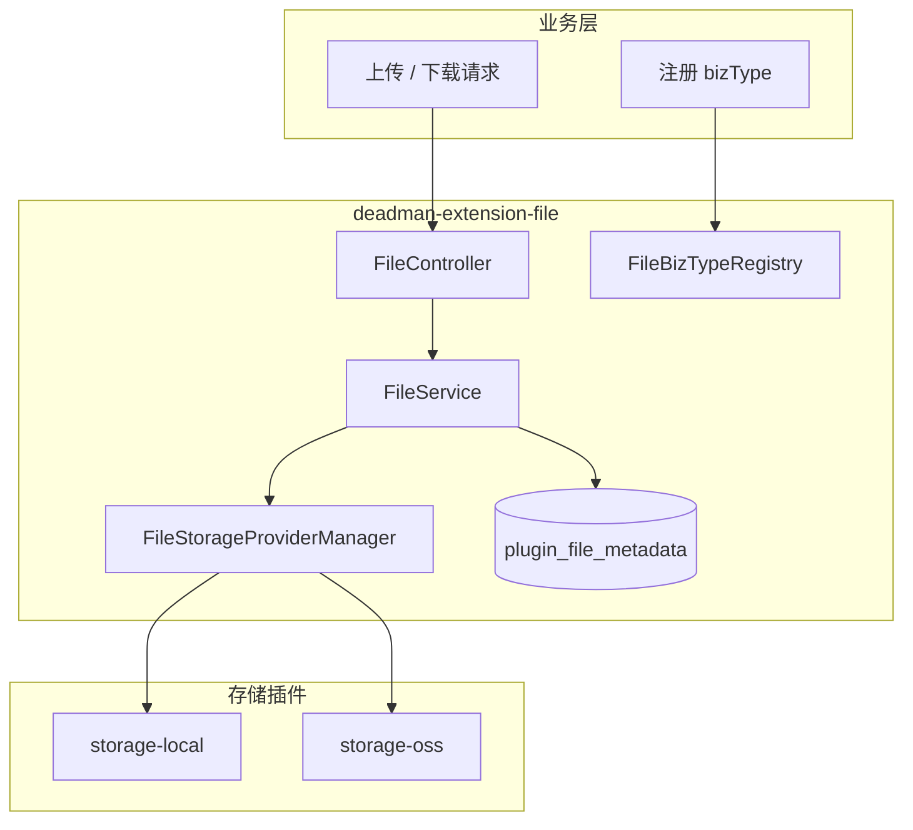
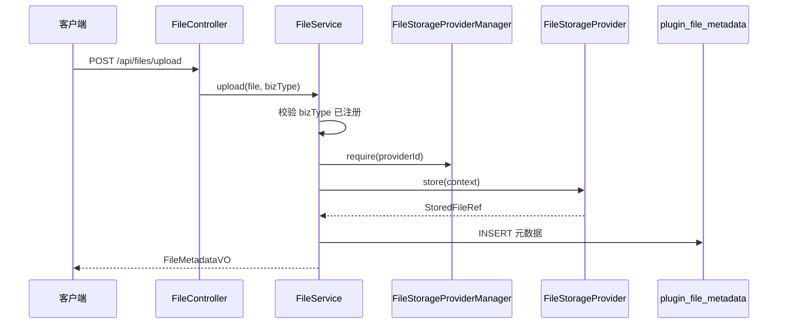
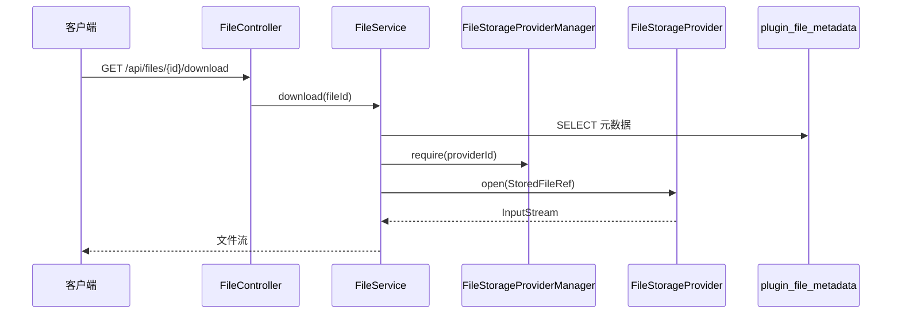

# deadman-extension-file

文件**能力延伸**模块（位于 `extensions/`）。通过 `FileStorageProvider` SPI 定义存储契约，由 `FileService` 统一负责元数据持久化、上传下载编排与业务分类管理。

> 存储后端具体实现放在 `plugins/`（如 [deadman-plugin-storage-local](../../plugins/deadman-plugin-storage-local/)、[deadman-plugin-storage-oss](../../plugins/deadman-plugin-storage-oss/)），只实现存储 Provider，**不得**重复定义文件元数据表。

---

## 目录

- [快速开始](#快速开始)
- [文件流程](#文件流程)
- [模块职责](#模块职责)
- [配置说明](#配置说明)
- [使用方法](#使用方法)
- [SPI 扩展](#spi-扩展)
- [数据库](#数据库)
- [扩展新存储后端](#扩展新存储后端)

---

## 快速开始

### 1. 引入依赖

```xml
<!-- 能力延伸：SPI + FileService + REST API -->
<dependency>
    <groupId>com.mtfm</groupId>
    <artifactId>deadman-extension-file</artifactId>
</dependency>
<!-- 存储实现（二选一或同时引入） -->
<dependency>
    <groupId>com.mtfm</groupId>
    <artifactId>deadman-plugin-storage-local</artifactId>
</dependency>
<dependency>
    <groupId>com.mtfm</groupId>
    <artifactId>deadman-plugin-storage-oss</artifactId>
</dependency>
```

### 2. 初始化数据库

执行 DDL：`src/main/resources/db/file/schema.sql`（表名 `plugin_file_metadata`）。

### 3. 最小配置

```yaml
deadman:
  plugin:
    file:
      enabled: true
      default-provider: local
    storage-local:
      enabled: true
      base-path: ./data/files
```

---

## 文件流程

### 总览



### 上传时序



### 下载时序



---

## 模块职责

| 层级 | 组件 | 职责 |
|------|------|------|
| 本模块 | `FileService` | 上传、下载、删除编排 |
| 本模块 | `FileController` | REST API |
| 本模块 | `FileStorageProviderManager` | 聚合存储 Provider |
| 本模块 | `FileBizTypeRegistry` | 业务分类注册与校验 |
| 存储插件 | `FileStorageProvider` | 落盘 / OSS 等具体存储 |

**核心约束**

- 元数据统一写入 `plugin_file_metadata`，存储插件不得自建文件表
- `bizType` 为业务分类标签；OSS 的 `storage_bucket` 由存储插件路由，不由业务传入

---

## 配置说明

配置前缀：`deadman.plugin.file`

| 配置项 | 类型 | 默认值 | 说明 |
|--------|------|--------|------|
| `enabled` | boolean | `true` | 是否启用文件能力 |
| `default-provider` | string | `local` | 默认存储 Provider |
| `max-file-size` | DataSize | `10MB` | 单文件大小上限 |
| `biz-type-strict` | boolean | `true` | 上传时强制校验 bizType 已注册 |

```yaml
deadman:
  plugin:
    file:
      enabled: true
      default-provider: oss
      max-file-size: 10MB
      biz-type-strict: true
```

---

## 使用方法

### REST API

| 方法 | 路径 | 说明 |
|------|------|------|
| POST | `/api/files/upload` | 上传（multipart，`bizType` 必填） |
| GET | `/api/files/{id}/download` | 下载 |
| GET | `/api/files/biz-types` | 查询已注册 bizType |

OpenAPI：[FileController.yaml](../../doc/deadman-plugin-file/FileController.yaml)

### 编程式上传

```java
@Autowired FileService fileService;

FileMetadataVO metadata = fileService.upload(file, "avatar", userId);
// metadata.accessUrl() → 公开访问地址（若 Provider 支持）
```

### 注册 bizType

```java
@Component
public class AvatarFileBizTypeContributor implements FileBizTypeContributor {
    @Override
    public Collection<String> contribute() {
        return List.of("avatar", "merchant-license");
    }
}
```

### 权限码

`file:upload`、`file:download`、`file:read`、`file:delete`

---

## SPI 扩展

```java
public interface FileStorageProvider {
    String providerId();
    StoredFileRef store(FileStorageUploadContext context);
    InputStream open(StoredFileRef ref);
    void delete(StoredFileRef ref);
    Optional<String> publicAccessUrl(StoredFileRef ref);
}
```

`StoredFileRef` 含 `providerId`、`storageKey`、`accessUrl`、可选 `storageBucket`（OSS 多 Bucket，仅元数据持久化）。

---

## 数据库

表名：`plugin_file_metadata`  
DDL：`src/main/resources/db/file/schema.sql`

| 字段 | 说明 |
|------|------|
| `file_code` | 文件编码，全局唯一 |
| `biz_type` | 业务分类 |
| `storage_provider` | 存储 Provider 标识 |
| `storage_key` | 存储对象 Key |
| `storage_bucket` | OSS Bucket（可选，内部使用） |
| `access_url` | 公开访问 URL |
| `original_filename` | 原始文件名 |
| `content_type` | MIME 类型 |
| `size_bytes` | 文件大小 |

---

## 扩展新存储后端

1. 新建 `plugins/deadman-plugin-storage-xxx`，依赖 `deadman-extension-file`
2. 实现 `FileStorageProvider` 并注册为 Spring Bean
3. 在 `deadman-app/pom.xml` 引入依赖并配置 `deadman.plugin.storage-xxx`

---

## 相关模块

| 模块 | 说明 |
|------|------|
| [deadman-plugin-storage-local](../../plugins/deadman-plugin-storage-local/) | 本地磁盘存储 |
| [deadman-plugin-storage-oss](../../plugins/deadman-plugin-storage-oss/) | 阿里云 OSS 存储 |
| [deadman-support-client-file](../../support/deadman-support-client-file/) | C 端文件上传桥接 |
| [extensions/README.md](../README.md) | 能力延伸目录说明 |
