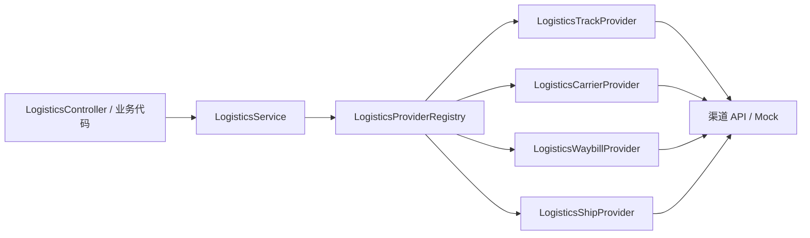

# deadman-extension-logistics

物流能力延伸：按领域定义 SPI 与配套模型（Context/Result record）、`LogisticsService` 编排与 REST API。

具体渠道实现（如快递100）放在 `plugins/deadman-plugin-logistics-kuaidi100`。

---

> **⚠️ 测试状态：尚未完成充分测试**
>
> 本模块已实现查单、识别、订阅、面单、寄件等 API 与 SPI 契约，但**尚未完成端到端与生产环境验证**。
> 当前自动化测试仅覆盖 Mock 轨迹查单等少量场景，订阅回调、面单、寄件等能力请在接入业务前自行联调验证。
> 不建议在未完成测试的情况下直接用于生产。

---

## 领域包结构

SPI 接口与各领域 POJO/record 放在同一子包下，便于插件实现时按领域引用：

```
spi/
├── LogisticsCapabilityProvider.java     # 所有领域 Provider 的公共父接口（providerId）
├── common/
│   └── LogisticsContactInfo             # 收寄件联系人（多领域共享）
├── track/                               # 轨迹领域
│   ├── LogisticsTrackProvider
│   ├── LogisticsTrackQueryContext / LogisticsTrackQueryResult
│   ├── LogisticsTrackNode
│   ├── LogisticsSubscribeContext / LogisticsSubscribeResult
│   ├── LogisticsSubscribePushPayload
│   └── LogisticsTrackSubscribePushHandler
├── carrier/                             # 识别领域
│   ├── LogisticsCarrierProvider
│   └── LogisticsCarrierDetectResult
├── waybill/                             # 面单领域
│   ├── LogisticsWaybillProvider
│   ├── LogisticsWaybillOrderContext / LogisticsWaybillOrderResult
│   └── LogisticsWaybillCancelContext / LogisticsWaybillCancelResult
└── ship/                                # 寄件领域
    ├── LogisticsShipProvider
    ├── LogisticsMerchantShipOrderContext / LogisticsMerchantShipOrderResult
    ├── LogisticsMerchantShipCancelContext / LogisticsMerchantShipCancelResult
    ├── LogisticsMerchantShipPriceContext / LogisticsMerchantShipPriceResult
    ├── LogisticsConsumerShipOrderContext / LogisticsConsumerShipOrderResult
    ├── LogisticsConsumerShipCancelContext / LogisticsConsumerShipCancelResult
    └── LogisticsConsumerShipPriceContext / LogisticsConsumerShipPriceResult
```

`LogisticsProviderRegistry` 按领域独立注册与解析 Provider（`requireTrack` / `requireCarrier` / `requireWaybill` / `requireShip`）。

---

## 快速开始

### 1. 引入依赖

```xml
<dependency>
    <groupId>com.mtfm</groupId>
    <artifactId>deadman-extension-logistics</artifactId>
</dependency>
<dependency>
    <groupId>com.mtfm</groupId>
    <artifactId>deadman-plugin-logistics-kuaidi100</artifactId>
</dependency>
```

### 2. 配置

```yaml
deadman:
  plugin:
    logistics:
      enabled: true
      default-provider: kuaidi100
      cache:
        enabled: true
        track-query-ttl: 5m       # 轨迹查询 Redis 短 TTL
        carrier-detect-ttl: 30m   # 快递公司识别缓存
    logistics-kuaidi100:
      enabled: true
      mock-enabled: true
      key: ${KUAIDI100_KEY:}
      customer: ${KUAIDI100_CUSTOMER:}
      secret: ${KUAIDI100_SECRET:}              # 面单/寄件接口必填
      subscribe-salt: ${KUAIDI100_SUBSCRIBE_SALT:}
```

### 3. 业务层查单

```java
import com.mtfm.deadman.plugin.logistics.spi.carrier.LogisticsCarriers;
import com.mtfm.deadman.plugin.logistics.spi.track.LogisticsTrackQueryContext;
import com.mtfm.deadman.plugin.logistics.spi.track.LogisticsTrackQueryResult;

// carrierCode 使用平台统一编码，如 YTO（圆通）、SF（顺丰）
LogisticsTrackQueryResult result = logisticsService.queryTrack(
        new LogisticsTrackQueryContext(LogisticsCarriers.YTO, "YT1234567890", null),
        null);
```

---

## 统一快递公司编码

各渠道厂商（快递100、菜鸟等）使用的快递公司编码各不相同。业务层与 REST API **统一使用平台编码**（见 `spi.carrier.LogisticsCarriers`），`LogisticsService` 在调用 Provider 前自动转换为厂商编码，返回时再转换回统一编码。

| 平台编码 | 快递公司 | 快递100 映射 |
|----------|----------|--------------|
| `YTO` | 圆通速递 | `yuantong` |
| `SF` | 顺丰速运 | `shunfeng` |
| `STO` | 申通快递 | `shentong` |
| `ZTO` | 中通快递 | `zhongtong` |
| `YD` | 韵达速递 | `yunda` |
| `JD` | 京东物流 | `jd` |
| `EMS` | 中国邮政 EMS | `ems` |
| `JTSD` | 极兔速递 | `jtexpress` |
| … | 更多见 `LogisticsCarriers` | 各插件 `*CarrierCodeContributor` |

扩展新渠道时，实现 `LogisticsCarrierCodeContributor` 注册映射即可，业务代码无需改动。

未注册或不支持当前渠道的编码将返回错误码 `14210`（`LOGISTICS_CARRIER_CODE_UNKNOWN`）。

---

## 查单流程



---

## REST API

| 方法 | 路径 | 权限 | 说明 |
|------|------|------|------|
| GET | `/api/logistics/tracks` | `logistics:track:query` | 实时查询轨迹（Redis 短 TTL 缓存） |
| GET | `/api/logistics/carriers/detect` | `logistics:carrier:detect` | 智能识别快递公司 |
| POST | `/api/logistics/tracks/subscribe` | `logistics:track:subscribe` | 订阅轨迹推送 |
| POST | `/api/logistics/waybills` | `logistics:waybill:create` | 电子面单下单 |
| POST | `/api/logistics/waybills/cancel` | `logistics:waybill:cancel` | 取消电子面单 |
| POST | `/api/logistics/ship/merchant` | `logistics:ship:merchant:create` | 商家寄件下单（官方快递） |
| POST | `/api/logistics/ship/merchant/cancel` | `logistics:ship:merchant:cancel` | 取消商家寄件 |
| POST | `/api/logistics/ship/merchant/price` | `logistics:ship:merchant:price` | 商家寄件询价 |
| POST | `/api/logistics/ship/consumer` | `logistics:ship:consumer:create` | C 端寄件下单 |
| POST | `/api/logistics/ship/consumer/cancel` | `logistics:ship:consumer:cancel` | 取消 C 端寄件 |
| POST | `/api/logistics/ship/consumer/price` | `logistics:ship:consumer:price` | C 端寄件询价 |

订阅推送回调（快递100 → 本系统，匿名 POST）：

```
POST /client/api/logistics/kuaidi100/subscribe/notify
```

业务侧可实现 `LogisticsTrackSubscribePushHandler` SPI 接收推送事件。

**Query 参数（查单）：**

| 参数 | 必填 | 说明 |
|------|------|------|
| `carrierCode` | 是 | 平台统一快递公司编码（如 `YTO`、`SF`，见 `LogisticsCarriers`） |
| `trackingNo` | 是 | 快递单号 |
| `phone` | 否 | 收/寄件人手机号后四位（顺丰等必填） |
| `providerId` | 否 | Provider 标识，默认 `kuaidi100` |

**响应示例：**

```json
{
  "code": 0,
  "data": {
    "providerId": "kuaidi100",
    "carrierCode": "YTO",
    "trackingNo": "YT123456",
    "state": "0",
    "signed": false,
    "message": "在途",
    "nodes": [
      {
        "time": "2026-06-22 10:00:00",
        "formattedTime": "2026-06-22 10:00:00",
        "context": "快件已到达【上海转运中心】",
        "status": "0",
        "location": "上海市",
        "areaName": "上海,上海市"
      }
    ]
  }
}
```

---

## SPI 契约（按领域划分）

所有领域 Provider 继承 `LogisticsCapabilityProvider`，仅声明 `providerId()`。

| 领域 | 包 | 接口 | 职责 |
|------|-----|------|------|
| 轨迹 | `spi.track` | `LogisticsTrackProvider` | 实时查单、订阅、推送验签 |
| 识别 | `spi.carrier` | `LogisticsCarrierProvider` | 智能识别快递公司 |
| 编码 | `spi.carrier` | `LogisticsCarrierCodeContributor` | 统一编码 ↔ 厂商编码映射 |
| 面单 | `spi.waybill` | `LogisticsWaybillProvider` | 电子面单下单/取消 |
| 寄件 | `spi.ship` | `LogisticsShipProvider` | 商家官方寄件、C 端寄件与询价 |

同一渠道（如 `kuaidi100`）可按需实现一个或多个领域接口。

### 轨迹领域示例

```java
public interface LogisticsTrackProvider extends LogisticsCapabilityProvider {
    LogisticsTrackQueryResult queryTrack(LogisticsTrackQueryContext context);
    LogisticsSubscribeResult subscribeTrack(LogisticsSubscribeContext context);
    LogisticsSubscribePushPayload parseSubscribePush(String rawParam, String sign);
}
```

---

## 配置说明

| 配置项 | 默认值 | 说明 |
|--------|--------|------|
| `deadman.plugin.logistics.enabled` | `true` | 是否启用物流能力 |
| `deadman.plugin.logistics.default-provider` | `kuaidi100` | 默认 Provider |
| `deadman.plugin.logistics.cache.enabled` | `true` | 是否启用 Redis 缓存 |
| `deadman.plugin.logistics.cache.track-query-ttl` | `5m` | 轨迹查询缓存 TTL |
| `deadman.plugin.logistics.cache.carrier-detect-ttl` | `30m` | 快递公司识别缓存 TTL |

---

## 权限

| 权限码 | 说明 |
|--------|------|
| `logistics:track:query` | 查询快递轨迹 |
| `logistics:carrier:detect` | 智能识别快递公司 |
| `logistics:track:subscribe` | 订阅轨迹推送 |
| `logistics:waybill:create` / `logistics:waybill:cancel` | 电子面单 |
| `logistics:ship:merchant:*` / `logistics:ship:consumer:*` | 商家/C 端寄件 |

通过 `LogisticsPermissionContributor` 自动注册到 RBAC 目录。

---

## 错误码

| 码 | 枚举 | 说明 |
|----|------|------|
| 14201 | `LOGISTICS_PROVIDER_NOT_FOUND` | Provider 未注册 |
| 14202 | `LOGISTICS_TRACK_QUERY_FAILED` | 查单失败 |
| 14203 | `LOGISTICS_CONFIG_INVALID` | 插件配置无效 |
| 14204 | `LOGISTICS_CARRIER_DETECT_FAILED` | 快递公司识别失败 |
| 14205 | `LOGISTICS_SUBSCRIBE_FAILED` | 快递轨迹订阅失败 |
| 14206 | `LOGISTICS_SUBSCRIBE_PUSH_INVALID` | 订阅推送验签失败 |
| 14207 | `LOGISTICS_WAYBILL_FAILED` | 电子面单操作失败 |
| 14208 | `LOGISTICS_SHIP_ORDER_FAILED` | 寄件下单失败 |
| 14209 | `LOGISTICS_SHIP_CANCEL_FAILED` | 寄件取消失败 |
| 14210 | `LOGISTICS_CARRIER_CODE_UNKNOWN` | 快递公司编码未注册或不支持当前渠道 |

---

## 扩展新 Provider

1. 新建 `plugins/deadman-plugin-logistics-xxx` 模块。
2. 实现 `LogisticsCarrierCodeContributor` 注册统一编码映射，并按需实现一个或多个领域 Provider。
3. 在 `deadman-app` 引入依赖并配置 `default-provider`。

---

## 已知测试覆盖

| 场景 | 状态 |
|------|------|
| Mock 轨迹查单（单元测试） | 已覆盖 |
| Redis 轨迹/识别缓存 | 未充分验证 |
| 订阅推送回调 | 未充分验证 |
| 电子面单 / 商家官方寄件 / C 端寄件 | 未充分验证 |
| 真实快递100 API 联调 | 未验证 |
