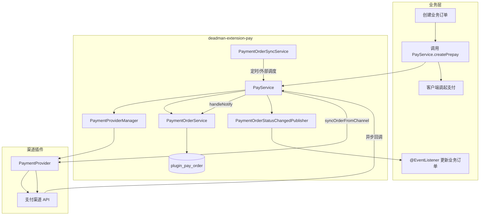
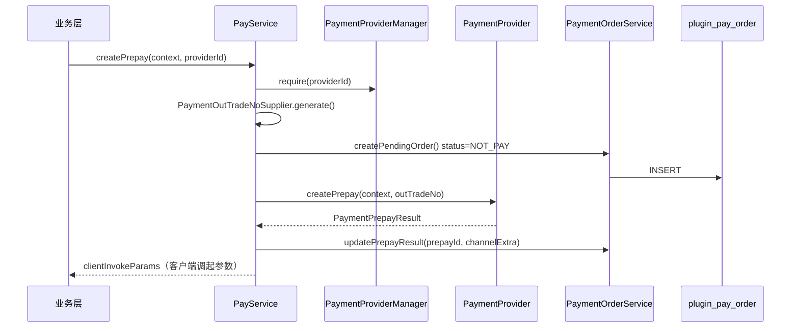
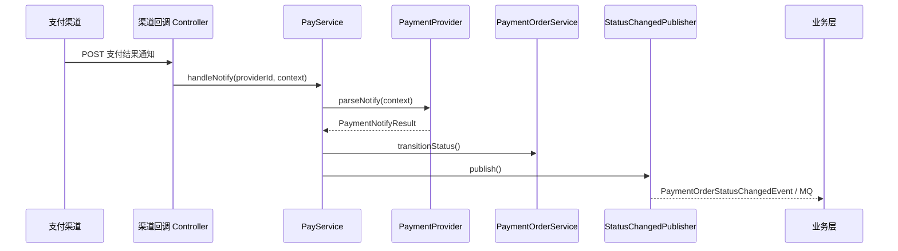
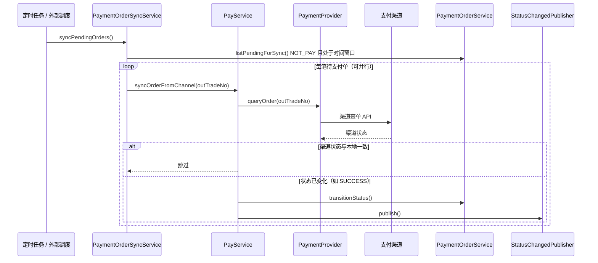

# deadman-extension-pay

支付**能力延伸**模块（位于 `extensions/`）。通过 `PaymentProvider` SPI 定义支付契约，由 `PayService` 统一负责订单持久化、流程编排与状态通知。

> 渠道具体实现放在 `plugins/`（如 [deadman-plugin-pay-wechat](../../plugins/deadman-plugin-pay-wechat/)），只实现渠道 API 与回调解析，**不得**自行持久化支付单。

---

## 目录

- [快速开始](#快速开始)
- [支付流程](#支付流程)
- [模块职责](#模块职责)
- [配置说明](#配置说明)
- [使用方法](#使用方法)
- [SPI 扩展](#spi-扩展)
- [数据库](#数据库)
- [扩展新渠道](#扩展新渠道)

---

## 快速开始

### 1. 引入依赖

在 `deadman-app/pom.xml` 中引入能力延伸模块及渠道插件：

```xml
<dependency>
    <groupId>com.mtfm</groupId>
    <artifactId>deadman-extension-pay</artifactId>
</dependency>
<dependency>
    <groupId>com.mtfm</groupId>
    <artifactId>deadman-plugin-pay-wechat</artifactId>
</dependency>
```

### 2. 初始化数据库

执行 DDL：`src/main/resources/db/pay/schema.sql`（表名 `plugin_pay_order`）。

### 3. 最小配置

```yaml
deadman:
  plugin:
    pay:
      enabled: true
      default-provider: wechat-jsapi
```

### 4. 业务代码

```java
@Autowired PayService payService;

// 发起支付
PaymentPrepayResult result = payService.createPrepay(
        PaymentPrepayContext.builder()
                .bizOrderNo("BIZ20260623001")
                .description("会员月卡")
                .amountTotal(9900)
                .payerUserId(userId)
                .channelParams(Map.of("openid", openid))
                .build(),
        "wechat-jsapi");

// 监听支付结果
@EventListener
void onPaid(PaymentOrderStatusChangedEvent event) {
    if ("SUCCESS".equals(event.currentStatus())) {
        // 更新业务订单
    }
}
```

---

## 支付流程

### 总览



### 预下单



### 支付回调



### 主动查单（回调补偿）



---

## 模块职责

| 层级 | 组件 | 职责 |
|------|------|------|
| 业务层 | 业务 Service | 创建业务订单、发起支付、监听结果、更新业务状态 |
| 本模块（extension-pay） | `PayService` | 统一门面：预下单、回调、查单 |
| 本模块（extension-pay） | `PaymentOrderService` | 订单 CRUD、状态流转 |
| 本模块（extension-pay） | `PaymentOrderSyncService` | 主动查单业务（与定时触发解耦） |
| 本模块（extension-pay） | `PaymentOrderSyncScheduler` | 内置 Spring 定时触发（可关闭） |
| 渠道插件 | `PaymentProvider` | 渠道 API、回调解析、查单 |

**核心约束**

- 平台支付单号 `out_trade_no` 由 `PayService` 统一生成，传入 Provider
- 所有渠道共用一张表 `plugin_pay_order`，渠道插件禁止自建订单表
- 回调与主动查单共用 `handleChannelPaymentResult`：更新状态 → 发布事件

---

## 配置说明

配置前缀：`deadman.plugin.pay`

### 基础配置

| 配置项 | 类型 | 默认值 | 说明 |
|--------|------|--------|------|
| `enabled` | boolean | `true` | 是否启用支付插件 |
| `default-provider` | string | `wechat-jsapi` | 默认 PaymentProvider 标识 |

### 主动查单 `sync.*`

| 配置项 | 类型 | 默认值 | 说明 |
|--------|------|--------|------|
| `sync.scheduler-enabled` | boolean | `true` | 是否启用内置 Spring 定时查单 |
| `sync.cron` | string | `0 * * * * ?` | 定时任务 cron 表达式 |
| `sync.min-age` | Duration | `2m` | 预下单后至少等待多久再查 |
| `sync.max-age` | Duration | `30m` | 超过该时间的待支付单不再查 |
| `sync.batch-size` | int | `50` | 单次扫描上限 |
| `sync.parallel-enabled` | boolean | `true` | 是否并行处理 |
| `sync.executor-bean-name` | string | — | 应用线程池 Bean 名（留空则用插件自建池） |
| `sync.parallelism` | int | `4` | 插件自建线程池大小（仅 `executor-bean-name` 为空时生效） |

### 完整示例

```yaml
deadman:
  plugin:
    pay:
      enabled: true
      default-provider: wechat-jsapi
      sync:
        scheduler-enabled: true
        cron: "0 * * * * ?"
        min-age: 2m
        max-age: 30m
        batch-size: 50
        parallel-enabled: true
        executor-bean-name: applicationTaskExecutor   # 推荐：复用应用全局线程池
        parallelism: 4                                # 仅插件自建池时生效
```

### 线程池解析优先级

1. **配置** `sync.executor-bean-name` → 使用应用已有线程池（推荐）
2. **编码** `@Bean(name = "payOrderSyncExecutor")` → 使用宿主注入的 Bean
3. **兜底** → 插件自动创建 `payOrderSyncExecutor` 默认线程池

### 环境变量对照

| 环境变量 | 对应配置项 |
|----------|-----------|
| `DEADMAN_PLUGIN_PAY_ENABLED` | `enabled` |
| `DEADMAN_PLUGIN_PAY_SYNC_SCHEDULER_ENABLED` | `sync.scheduler-enabled` |
| `DEADMAN_PLUGIN_PAY_SYNC_CRON` | `sync.cron` |
| `DEADMAN_PLUGIN_PAY_SYNC_MIN_AGE` | `sync.min-age` |
| `DEADMAN_PLUGIN_PAY_SYNC_MAX_AGE` | `sync.max-age` |
| `DEADMAN_PLUGIN_PAY_SYNC_BATCH_SIZE` | `sync.batch-size` |
| `DEADMAN_PLUGIN_PAY_SYNC_PARALLEL_ENABLED` | `sync.parallel-enabled` |
| `DEADMAN_PLUGIN_PAY_SYNC_EXECUTOR_BEAN_NAME` | `sync.executor-bean-name` |
| `DEADMAN_PLUGIN_PAY_SYNC_PARALLELISM` | `sync.parallelism` |

---

## 使用方法

### PayService API

| 方法 | 说明 |
|------|------|
| `createPrepay(context)` | 使用默认 Provider 预下单 |
| `createPrepay(context, providerId)` | 指定 Provider 预下单 |
| `queryOrder(outTradeNo)` | 从本地订单表查询快照 |
| `handleNotify(providerId, context)` | 处理支付回调 |
| `syncOrderFromChannel(outTradeNo)` | 主动向渠道查单并同步 |
| `listProviders()` | 列出已注册 Provider |

### 发起支付

```java
PaymentPrepayResult result = payService.createPrepay(
        PaymentPrepayContext.builder()
                .bizOrderNo(order.getOrderNo())
                .description("会员月卡")
                .amountTotal(9900)          // 单位：分
                .payerUserId(userId)
                .channelParams(Map.of("openid", openid))  // 渠道扩展参数
                .build(),
        "wechat-jsapi");

String outTradeNo = result.outTradeNo();                    // 平台支付单号
PaymentClientInvokeParams params = result.clientInvokeParams();  // 客户端调起参数
```

### 查询本地支付单

```java
PaymentOrderSnapshot snapshot = payService.queryOrder("PO20260623120000123456");
// snapshot.status() → NOT_PAY / SUCCESS / CLOSED / REFUND
```

### 监听支付结果（默认 Spring Event）

```java
@EventListener
public void onPaymentStatusChanged(PaymentOrderStatusChangedEvent event) {
    if ("SUCCESS".equals(event.currentStatus())) {
        PaymentOrder order = event.order();
        businessOrderService.markPaid(order.getBizOrderNo());
    }
}
```

### 关闭内置定时，接入外部调度

```yaml
deadman:
  plugin:
    pay:
      sync:
        scheduler-enabled: false
```

```java
@Autowired PaymentOrderSyncService paymentOrderSyncService;

paymentOrderSyncService.syncPendingOrders();              // 批量扫描
paymentOrderSyncService.syncOrder("PO20260623120000123456");  // 单笔补偿
```

---

## SPI 扩展

### PaymentProvider（渠道插件实现）

```java
public interface PaymentProvider {
    String providerId();      // 全局唯一，如 wechat-jsapi
    String payPlatform();     // WECHAT / ALIPAY
    String payMethod();       // JSAPI / NATIVE / APP

    PaymentPrepayResult createPrepay(PaymentPrepayContext context, String outTradeNo);
    PaymentNotifyResult parseNotify(PaymentNotifyContext context);
    PaymentQueryResult queryOrder(String outTradeNo);
}
```

### PaymentOutTradeNoSupplier（自定义单号）

默认格式：`PO + yyyyMMddHHmmss + 6位随机数`。宿主可覆盖：

```java
@Bean
public PaymentOutTradeNoSupplier paymentOutTradeNoSupplier() {
    return (context, provider) -> "BIZ_" + context.getBizOrderNo();
}
```

> 单号需全局唯一，并符合渠道长度限制（微信 `out_trade_no` 最长 32 字符）。

### PaymentOrderStatusChangedPublisher（自定义事件发布）

默认使用 Spring `ApplicationEvent`，可替换为 MQ：

```java
@Bean
public PaymentOrderStatusChangedPublisher paymentOrderStatusChangedPublisher(
        RabbitTemplate rabbitTemplate) {
    return (order, previous, current) -> rabbitTemplate.convertAndSend(
            "pay.order.status",
            Map.of("outTradeNo", order.getOutTradeNo(), "status", current));
}
```

### 复用应用线程池

```java
@Bean(name = "payOrderSyncExecutor")
public Executor payOrderSyncExecutor(@Qualifier("applicationTaskExecutor") Executor appExecutor) {
    return appExecutor;
}
```

---

## 数据库

表名：`plugin_pay_order`  
DDL：`src/main/resources/db/pay/schema.sql`

| 字段 | 说明 |
|------|------|
| `out_trade_no` | 平台支付单号，全局唯一 |
| `biz_order_no` | 业务订单号 |
| `amount_total` | 金额（分） |
| `status` | `NOT_PAY` / `SUCCESS` / `CLOSED` / `REFUND` |
| `pay_platform` | 支付平台：`WECHAT`、`ALIPAY` |
| `pay_method` | 支付方式：`JSAPI`、`NATIVE` 等 |
| `provider_id` | Provider 标识 |
| `channel_prepay_id` | 渠道预支付 ID |
| `channel_transaction_id` | 渠道支付单号 |
| `channel_extra` | 渠道扩展 JSON |
| `payer_user_id` | 付款人用户 ID |
| `notify_raw` | 最近一次回调原文 |

---

## 扩展新渠道

1. 新建 Maven 模块（如 `plugins/deadman-plugin-pay-alipay`），依赖 `deadman-extension-pay`
2. 实现 `PaymentProvider` 并注册为 Spring Bean
3. `createPrepay` 只调渠道 API，不持久化订单
4. `parseNotify` 完成验签与标准化解析
5. `queryOrder` 实现渠道查单
6. 在 `deadman-app/pom.xml` 引入依赖

---

## 相关模块

| 模块 | 说明 |
|------|------|
| [deadman-plugin-pay-wechat](../../plugins/deadman-plugin-pay-wechat/) | 微信 JSAPI 支付实现 |
| [extensions/README.md](../README.md) | 能力延伸目录说明 |
| [plugins/README.md](../../plugins/README.md) | 插件目录说明 |
