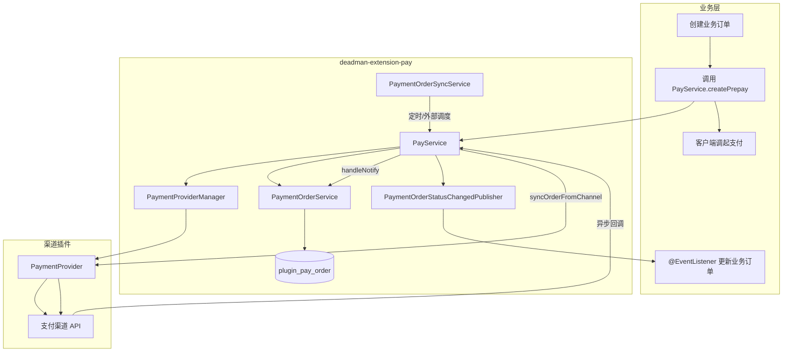
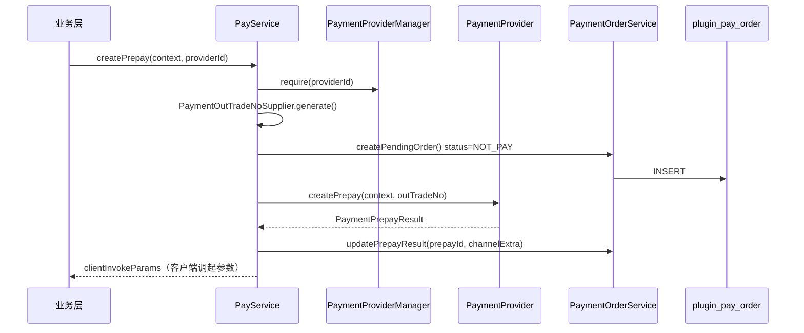
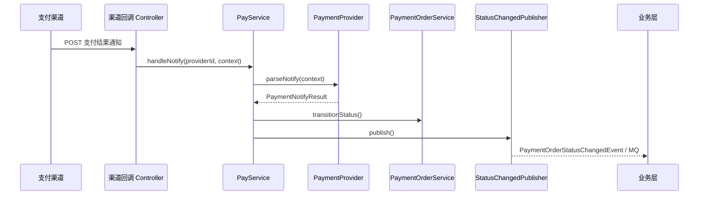
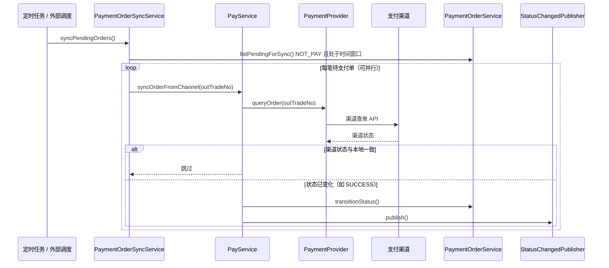

# deadman-extension-pay

支付**能力延伸**模块（位于 `extensions/`）。业务请按资金链路使用三分域门面：

- `DirectPayFacade`：直连自营支付/退款（`fund_lane=DIRECT`）
- `EcommerceTradeFacade`：收付通合单/分账/退款（`fund_lane=ECOMMERCE`）
- `PayoutFacade`：商家转账到零钱（仅运营账户）
- `SubMerchantFacade`：二级商户进件/绑号
- `PayScoreFacade`：微信支付分骨架，暂不落库

底层仍通过 `PaymentProvider` / `RefundProvider` / `TransferProvider` / `ProfitSharingProvider` / `SubMerchantProvider` / `PayScoreProvider` SPI 对接渠道；`PayService` 等为过渡编排层。

双链路规范见 [docs/双链路资金隔离架构.md](docs/双链路资金隔离架构.md)，接入步骤见 [docs/接入指南.md](docs/接入指南.md)。

> 渠道具体实现放在 `plugins/`（如 [deadman-plugin-pay-wechat](../../plugins/deadman-plugin-pay-wechat/)），只实现渠道 API 与回调解析，**不得**自行持久化支付单。

**业务接入请优先阅读：** [docs/接入指南.md](docs/接入指南.md)（支付 / 退款 / 转账、配置、生产检查清单）。

---

## 目录

- [快速开始](#快速开始)
- [支付流程](#支付流程)
- [模块职责](#模块职责)
- [配置说明](#配置说明)
- [使用方法](#使用方法)
- [SPI 扩展](#spi-扩展)
- [数据库](#数据库)
- [商家转账](#商家转账)
- [扩展新渠道](#扩展新渠道)
- [接入指南](docs/接入指南.md)

---

## 快速开始

### 1. 引入依赖

在 `deadman-app/pom.xml` 中引入能力延伸模块及渠道插件：

```xml
<dependency>
    <groupId>com.mtfm</groupId>
    <artifactId>deadman-extension-pay</artifactId>
</dependency>
<dependency>
    <groupId>com.mtfm</groupId>
    <artifactId>deadman-plugin-pay-wechat</artifactId>
</dependency>
```

### 2. 初始化数据库

执行 DDL：`src/main/resources/db/pay/schema.sql`（表名 `plugin_pay_order`）。

### 3. 最小配置

```yaml
deadman:
  plugin:
    pay:
      enabled: true
      default-provider: wechat-jsapi
```

### 4. 业务代码

```java
@Autowired PayService payService;

// 发起支付
PaymentPrepayResult result = payService.createPrepay(
        PaymentPrepayContext.builder()
                .bizOrderNo("BIZ20260623001")
                .description("会员月卡")
                .amountTotal(9900)
                .payerUserId(userId)
                .channelParams(Map.of("openid", openid))
                .build(),
        "wechat-jsapi");

// 监听支付结果
@EventListener
void onPaid(PaymentOrderStatusChangedEvent event) {
    if ("SUCCESS".equals(event.currentStatus())) {
        // 更新业务订单
    }
}
```

---

## 支付流程

### 总览


```mermaid
flowchart TB
    subgraph 业务层
        A[创建业务订单]
        B[调用 PayService.createPrepay]
        C[客户端调起支付]
        D["@EventListener 更新业务订单"]
    end

    subgraph deadman-extension-pay
        PS[PayService]
        POM[PaymentProviderManager]
        POS[PaymentOrderService]
        DB[(plugin_pay_order)]
        SYNC[PaymentOrderSyncService]
        PUB[PaymentOrderStatusChangedPublisher]
    end

    subgraph 渠道插件
        PR[PaymentProvider]
        CH[支付渠道 API]
    end

    A --> B --> PS
    PS --> POM --> PR --> CH
    PS --> POS --> DB
    B --> C

    CH -->|异步回调| PS
    PS -->|handleNotify| POS
    PS --> PUB --> D

    SYNC -->|定时/外部调度| PS
    PS -->|syncOrderFromChannel| PR
    PR --> CH
```

### 预下单


```mermaid
sequenceDiagram
    participant Biz as 业务层
    participant Pay as PayService
    participant Mgr as PaymentProviderManager
    participant Prov as PaymentProvider
    participant Ord as PaymentOrderService
    participant DB as plugin_pay_order

    Biz->>Pay: createPrepay(context, providerId)
    Pay->>Mgr: require(providerId)
    Pay->>Pay: PaymentOutTradeNoSupplier.generate()
    Pay->>Ord: createPendingOrder()  status=NOT_PAY
    Ord->>DB: INSERT
    Pay->>Prov: createPrepay(context, outTradeNo)
    Prov-->>Pay: PaymentPrepayResult
    Pay->>Ord: updatePrepayResult(prepayId, channelExtra)
    Pay-->>Biz: clientInvokeParams（客户端调起参数）
```

### 支付回调


```mermaid
sequenceDiagram
    participant CH as 支付渠道
    participant Ctrl as 渠道回调 Controller
    participant Pay as PayService
    participant Prov as PaymentProvider
    participant Ord as PaymentOrderService
    participant Pub as StatusChangedPublisher
    participant Biz as 业务层

    CH->>Ctrl: POST 支付结果通知
    Ctrl->>Pay: handleNotify(providerId, context)
    Pay->>Prov: parseNotify(context)
    Prov-->>Pay: PaymentNotifyResult
    Pay->>Ord: transitionStatus()
    Pay->>Pub: publish()
    Pub-->>Biz: PaymentOrderStatusChangedEvent / MQ
```

### 主动查单（回调补偿）


```mermaid
sequenceDiagram
    participant Job as 定时任务 / 外部调度
    participant Sync as PaymentOrderSyncService
    participant Pay as PayService
    participant Prov as PaymentProvider
    participant CH as 支付渠道
    participant Ord as PaymentOrderService
    participant Pub as StatusChangedPublisher

    Job->>Sync: syncPendingOrders()
    Sync->>Ord: listPendingForSync()  NOT_PAY 且处于时间窗口
    loop 每笔待支付单（可并行）
        Sync->>Pay: syncOrderFromChannel(outTradeNo)
        Pay->>Prov: queryOrder(outTradeNo)
        Prov->>CH: 渠道查单 API
        CH-->>Prov: 渠道状态
        alt 渠道状态与本地一致
            Pay-->>Sync: 跳过
        else 状态已变化（如 SUCCESS）
            Pay->>Ord: transitionStatus()
            Pay->>Pub: publish()
        end
    end
```

---

## 模块职责

| 层级 | 组件 | 职责 |
|------|------|------|
| 业务层 | 业务 Service | 创建业务订单、发起支付、监听结果、更新业务状态 |
| 本模块（extension-pay） | `PayService` | 统一门面：预下单、回调、查单 |
| 本模块（extension-pay） | `PaymentOrderService` | 订单 CRUD、状态流转 |
| 本模块（extension-pay） | `PaymentOrderSyncService` | 主动查单业务（与定时触发解耦） |
| 本模块（extension-pay） | `PaymentOrderSyncScheduler` | 内置 Spring 定时触发（可关闭） |
| 渠道插件 | `PaymentProvider` | 渠道 API、回调解析、查单 |

**核心约束**

- 平台支付单号 `out_trade_no` 由 `PayService` 统一生成，传入 Provider
- 所有渠道共用一张表 `plugin_pay_order`，渠道插件禁止自建订单表
- 回调与主动查单共用 `handleChannelPaymentResult`：更新状态 → 发布事件

---

## 配置说明

配置前缀：`deadman.plugin.pay`

### 基础配置

| 配置项 | 类型 | 默认值 | 说明 |
|--------|------|--------|------|
| `enabled` | boolean | `true` | 是否启用支付插件 |
| `default-provider` | string | `wechat-jsapi` | 默认 PaymentProvider 标识 |
| `test-mode.payment.enabled` | boolean | `false` | 支付测试：预下单金额覆盖为固定小额（可与真实微信联调） |
| `test-mode.payment.fixed-amount-cents` | int | `1` | 支付测试固定金额（分），`1` 即 0.01 元 |
| `test-mode.sub-merchant.enabled` | boolean | `false` | 进件测试：不调微信，进件/查单/媒体上传直接模拟通过 |

> 支付测试会同时改写本地 `plugin_pay_order.amount_total` 与渠道下单金额。可退金额以支付单为准；业务订单展示金额不受影响。进件测试与支付测试相互独立。生产环境务必关闭。

### 主动查单 `sync.*`

| 配置项 | 类型 | 默认值 | 说明 |
|--------|------|--------|------|
| `sync.scheduler-enabled` | boolean | `true` | 是否启用内置 Spring 定时查单 |
| `sync.cron` | string | `0 * * * * ?` | 定时任务 cron 表达式 |
| `sync.min-age` | Duration | `2m` | 预下单后至少等待多久再查 |
| `sync.max-age` | Duration | `30m` | 超过该时间的待支付单不再查 |
| `sync.batch-size` | int | `50` | 单次扫描上限 |
| `sync.parallel-enabled` | boolean | `true` | 是否并行处理 |
| `sync.executor-bean-name` | string | — | 应用线程池 Bean 名（留空则用插件自建池） |
| `sync.parallelism` | int | `4` | 插件自建线程池大小（仅 `executor-bean-name` 为空时生效） |

### 事件与事务边界

- 支付/退款状态回写、成功退款金额累加、状态变更事件发布在同一短事务内（`PaymentChannelResultApplier` / `RefundChannelResultApplier`）。
- 同步 `@EventListener`（如业务侧退款成功处理）加入该事务，可与支付库表同库回滚。
- 异常退款使用 `@TransactionalEventListener(AFTER_COMMIT)` + `@Async`，仅在提交后外呼渠道，不使用 `fallbackExecution`。

### 异常退款 `abnormal-refund.*`

退款申请/回调/查单结果为 `ABNORMAL` 时，在事务提交后由 `PaymentRefundAbnormalListener` 异步调用渠道「发起异常退款」。失败会清除 `abnormal_handled` 标记，由 `refund-sync` 补偿重试。

| 配置项 | 类型 | 默认值 | 说明 |
|--------|------|--------|------|
| `abnormal-refund.auto-enabled` | boolean | `false` | 是否自动发起异常退款；默认关闭（商户回收≠买家退款履约） |
| `abnormal-refund.default-receive-type` | string | `MERCHANT_BANK_CARD` | 默认入账方式；`USER_BANK_CARD` 需业务另行提供银行卡信息 |

### 退款补偿 `refund-sync.*`

| 配置项 | 类型 | 默认值 | 说明 |
|--------|------|--------|------|
| `refund-sync.scheduler-enabled` | boolean | `true` | 是否启用内置退款查单/异常退款补偿定时任务 |
| `refund-sync.cron` | string | `30 * * * * ?` | 定时 cron |
| `refund-sync.min-age` | Duration | `1m` | 创建后至少等待多久再查 |
| `refund-sync.max-age` | Duration | `24h` | 超过该时间不再主动查 |
| `refund-sync.batch-size` | int | `50` | 单次扫描上限 |
| `refund-sync.parallel-enabled` | boolean | `true` | 是否并行处理 |

### 完整示例

```yaml
deadman:
  plugin:
    pay:
      enabled: true
      default-provider: wechat-jsapi
      test-mode:
        payment:
          enabled: false
          fixed-amount-cents: 1
        sub-merchant:
          enabled: false
      abnormal-refund:
        auto-enabled: false
        default-receive-type: MERCHANT_BANK_CARD
      refund-sync:
        scheduler-enabled: true
        cron: "30 * * * * ?"
        min-age: 1m
        max-age: 24h
        batch-size: 50
        parallel-enabled: true
      sync:
        scheduler-enabled: true
        cron: "0 * * * * ?"
        min-age: 2m
        max-age: 30m
        batch-size: 50
        parallel-enabled: true
        executor-bean-name: applicationTaskExecutor   # 推荐：复用应用全局线程池
        parallelism: 4                                # 仅插件自建池时生效
```

### 线程池解析优先级

1. **配置** `sync.executor-bean-name` → 使用应用已有线程池（推荐）
2. **编码** `@Bean(name = "payOrderSyncExecutor")` → 使用宿主注入的 Bean
3. **兜底** → 插件自动创建 `payOrderSyncExecutor` 默认线程池

### 环境变量对照

| 环境变量 | 对应配置项 |
|----------|-----------|
| `DEADMAN_PLUGIN_PAY_ENABLED` | `enabled` |
| `DEADMAN_PLUGIN_PAY_SYNC_SCHEDULER_ENABLED` | `sync.scheduler-enabled` |
| `DEADMAN_PLUGIN_PAY_SYNC_CRON` | `sync.cron` |
| `DEADMAN_PLUGIN_PAY_SYNC_MIN_AGE` | `sync.min-age` |
| `DEADMAN_PLUGIN_PAY_SYNC_MAX_AGE` | `sync.max-age` |
| `DEADMAN_PLUGIN_PAY_SYNC_BATCH_SIZE` | `sync.batch-size` |
| `DEADMAN_PLUGIN_PAY_SYNC_PARALLEL_ENABLED` | `sync.parallel-enabled` |
| `DEADMAN_PLUGIN_PAY_SYNC_EXECUTOR_BEAN_NAME` | `sync.executor-bean-name` |
| `DEADMAN_PLUGIN_PAY_SYNC_PARALLELISM` | `sync.parallelism` |

---

## 使用方法

### PayService API

| 方法 | 说明 |
|------|------|
| `createPrepay(context)` | 使用默认 Provider 预下单 |
| `createPrepay(context, providerId)` | 指定 Provider 预下单 |
| `queryOrder(outTradeNo)` | 从本地订单表查询快照 |
| `handleNotify(providerId, context)` | 处理支付回调 |
| `syncOrderFromChannel(outTradeNo)` | 主动向渠道查单并同步 |
| `listProviders()` | 列出已注册 Provider |

### 发起支付

```java
PaymentPrepayResult result = payService.createPrepay(
        PaymentPrepayContext.builder()
                .bizOrderNo(order.getOrderNo())
                .description("会员月卡")
                .amountTotal(9900)          // 单位：分
                .payerUserId(userId)
                .channelParams(Map.of("openid", openid))  // 渠道扩展参数
                .build(),
        "wechat-jsapi");

String outTradeNo = result.outTradeNo();                    // 平台支付单号
PaymentClientInvokeParams params = result.clientInvokeParams();  // 客户端调起参数
```

### 查询本地支付单

```java
PaymentOrderSnapshot snapshot = payService.queryOrder("PO20260623120000123456");
// snapshot.status() → NOT_PAY / SUCCESS / CLOSED / REFUND
```

### 监听支付结果（默认 Spring Event）

```java
@EventListener
public void onPaymentStatusChanged(PaymentOrderStatusChangedEvent event) {
    if ("SUCCESS".equals(event.currentStatus())) {
        PaymentOrder order = event.order();
        businessOrderService.markPaid(order.getBizOrderNo());
    }
}
```

### 关闭内置定时，接入外部调度

```yaml
deadman:
  plugin:
    pay:
      sync:
        scheduler-enabled: false
```

```java
@Autowired PaymentOrderSyncService paymentOrderSyncService;

paymentOrderSyncService.syncPendingOrders();              // 批量扫描
paymentOrderSyncService.syncOrder("PO20260623120000123456");  // 单笔补偿
```

---

## SPI 扩展

### PaymentProvider（渠道插件实现）

```java
public interface PaymentProvider {
    String providerId();      // 全局唯一，如 wechat-jsapi
    String payPlatform();     // WECHAT / ALIPAY
    String payMethod();       // JSAPI / NATIVE / APP

    PaymentPrepayResult createPrepay(PaymentPrepayContext context, String outTradeNo);
    PaymentNotifyResult parseNotify(PaymentNotifyContext context);
    PaymentQueryResult queryOrder(String outTradeNo);
}
```

### PaymentOutTradeNoSupplier（自定义单号）

默认格式：`PO + yyyyMMddHHmmss + 6位随机数`。宿主可覆盖：

```java
@Bean
public PaymentOutTradeNoSupplier paymentOutTradeNoSupplier() {
    return (context, provider) -> "BIZ_" + context.getBizOrderNo();
}
```

> 单号需全局唯一，并符合渠道长度限制（微信 `out_trade_no` 最长 32 字符）。

### PaymentOrderStatusChangedPublisher（自定义事件发布）

默认使用 Spring `ApplicationEvent`，可替换为 MQ：

```java
@Bean
public PaymentOrderStatusChangedPublisher paymentOrderStatusChangedPublisher(
        RabbitTemplate rabbitTemplate) {
    return (order, previous, current) -> rabbitTemplate.convertAndSend(
            "pay.order.status",
            Map.of("outTradeNo", order.getOutTradeNo(), "status", current));
}
```

### 复用应用线程池

```java
@Bean(name = "payOrderSyncExecutor")
public Executor payOrderSyncExecutor(@Qualifier("applicationTaskExecutor") Executor appExecutor) {
    return appExecutor;
}
```

---

## 数据库

表名：`plugin_pay_order`  
DDL：`src/main/resources/db/pay/schema.sql`

| 字段 | 说明 |
|------|------|
| `out_trade_no` | 平台支付单号，全局唯一 |
| `biz_order_no` | 业务订单号 |
| `amount_total` | 金额（分） |
| `status` | `NOT_PAY` / `SUCCESS` / `CLOSED` / `REFUND` |
| `pay_platform` | 支付平台：`WECHAT`、`ALIPAY` |
| `pay_method` | 支付方式：`JSAPI`、`NATIVE` 等 |
| `provider_id` | Provider 标识 |
| `channel_prepay_id` | 渠道预支付 ID |
| `channel_transaction_id` | 渠道支付单号 |
| `channel_extra` | 渠道扩展 JSON |
| `payer_user_id` | 付款人用户 ID |
| `notify_raw` | 最近一次回调原文 |

---

## 商家转账

对齐微信「商家转账」能力：额度由 **API** 配置（非 yaml），超单笔限额自动拆成多笔 `PENDING` 待转，按额度逐笔派发；日/月额度不足时停止，额度解锁或人工恢复后再派发。

### 管理端 API（需权限）

| 方法 | 路径 | 权限 | 说明 |
|------|------|------|------|
| GET | `/api/pay/transfer/quota` | `pay:transfer:quota:read` | 查询额度与日/月占用 |
| PUT | `/api/pay/transfer/quota` | `pay:transfer:quota:write` | 配置主体类型与单笔/用户日/日额度 |
| POST | `/api/pay/transfer/dispatch/pause` | `pay:transfer:dispatch` | 人工停止全局派发 |
| POST | `/api/pay/transfer/dispatch/resume` | `pay:transfer:dispatch` | 恢复并立即派发一轮 |
| POST | `/api/pay/transfer/dispatch/run` | `pay:transfer:dispatch` | 手动触发派发 |
| POST | `/api/pay/transfer` | `pay:transfer:create` | 发起转账（自动拆单） |
| GET | `/api/pay/transfer/batches` | `pay:transfer:read` | 分页查询转账批次 |
| GET | `/api/pay/transfer/batches/{batchNo}` | `pay:transfer:read` | 查询批次与明细 |
| POST | `/api/pay/transfer/batches/{batchNo}/stop` | `pay:transfer:dispatch` | 停止单批次 |
| POST | `/api/pay/transfer/batches/{batchNo}/resume` | `pay:transfer:dispatch` | 恢复单批次 |

额度可调范围对齐微信说明（单位分）；月额度随主体类型固定（非个体户 3000 万 / 个体户 10 万）。运行时仅维护**单行**额度配置（切换主体类型更新同一行）。

创建行为：
- 同一 `bizOrderNo` **幂等**返回原批次；金额 / openid / 场景 / Provider 不一致时报 `PAY_TRANSFER_IDEMPOTENT_CONFLICT`
- 只落 `PENDING`，由定时派发 / `dispatch/run` / 批次 resume 触发外呼（创建接口不打渠道）
- 总金额默认上限 10 万元、拆单默认最多 500 笔（`transfer-limits`）
- 收款人姓名经 `deadman-extension-crypto` 用 **pay 模块密钥** 信封加密落库，派发前解密
- 渠道明确拒绝才落 `FAIL`；超时/系统错误保留 `PROCESSING` 并查单；硬终态冲突抛错（回调失败 ACK）

依赖：本模块依赖 `deadman-extension-crypto`；请在 app 配置 `default-key` 和/或 `module-keys.pay.key`。

完整接入步骤、生产检查清单与已知运维项见 [docs/接入指南.md](docs/接入指南.md)。

### 调度配置

```yaml
deadman:
  plugin:
    pay:
      transfer-limits:
        max-amount-cents: 10000000
        max-bills-per-batch: 500
      transfer-dispatch:
        scheduler-enabled: true
        cron: "15 * * * * ?"
        batch-size: 20
      transfer-sync:
        scheduler-enabled: true
        cron: "45 * * * * ?"
```

增量 DDL：`deadman-app/src/main/resources/db/migration/20260810_pay_transfer.sql`。

权限码：`pay:transfer:quota:read|write`、`pay:transfer:create`、`pay:transfer:read`、`pay:transfer:dispatch`（需给角色授权）。

---

## 扩展新渠道

1. 新建 Maven 模块（如 `plugins/deadman-plugin-pay-alipay`），依赖 `deadman-extension-pay`
2. 实现 `PaymentProvider` 并注册为 Spring Bean
3. `createPrepay` 只调渠道 API，不持久化订单
4. `parseNotify` 完成验签与标准化解析
5. `queryOrder` 实现渠道查单
6. 在 `deadman-app/pom.xml` 引入依赖

---

## 相关模块

| 模块 | 说明 |
|------|------|
| [docs/接入指南.md](docs/接入指南.md) | **业务/运维接入指南**（支付·退款·转账） |
| [deadman-plugin-pay-wechat](../../plugins/deadman-plugin-pay-wechat/) | 微信 JSAPI 支付/退款/转账实现 |
| [deadman-plugin-pay-mock](../../plugins/deadman-plugin-pay-mock/) | Mock 支付实现（本地/测试） |
| [extensions/README.md](../README.md) | 能力延伸目录说明 |
| [plugins/README.md](../../plugins/README.md) | 插件目录说明 |
