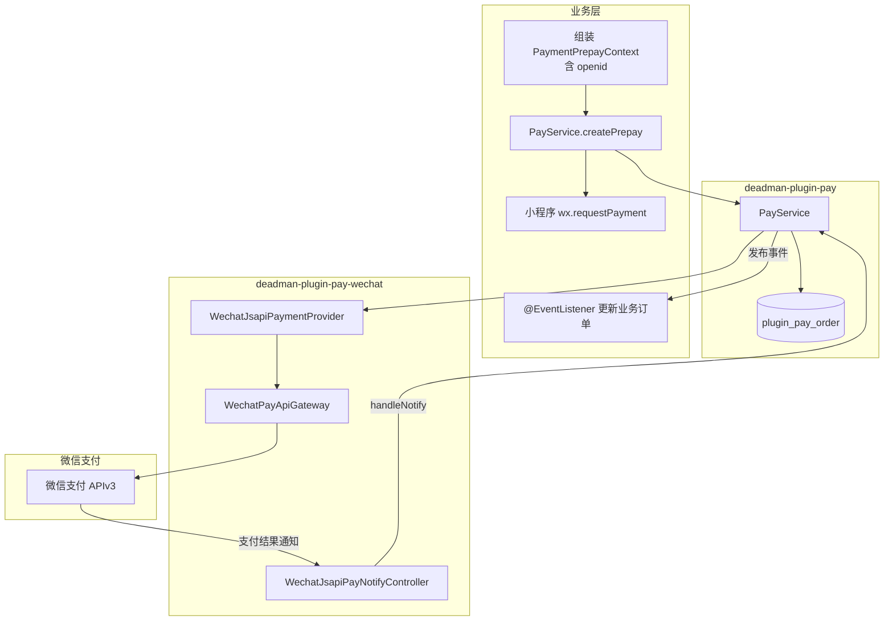
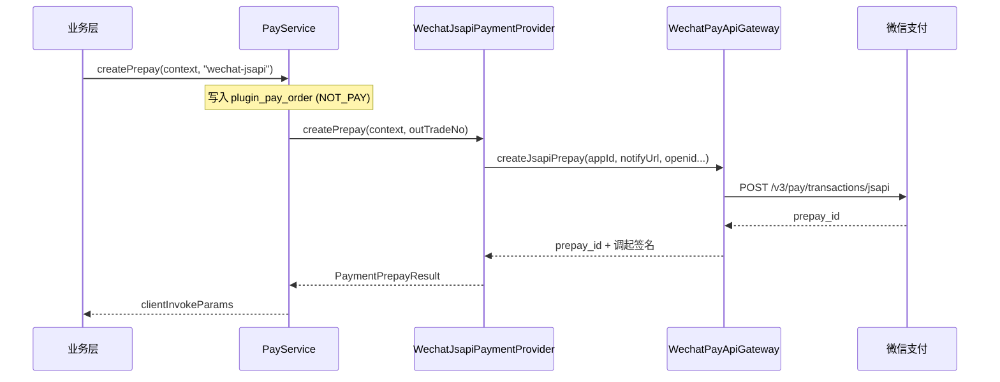
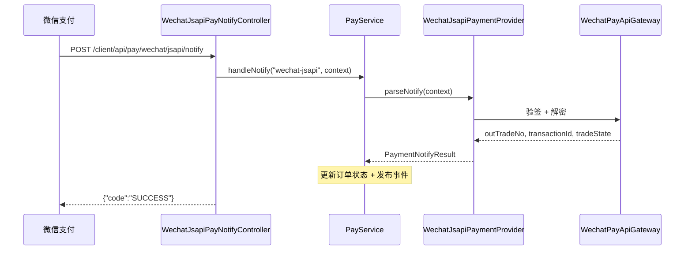
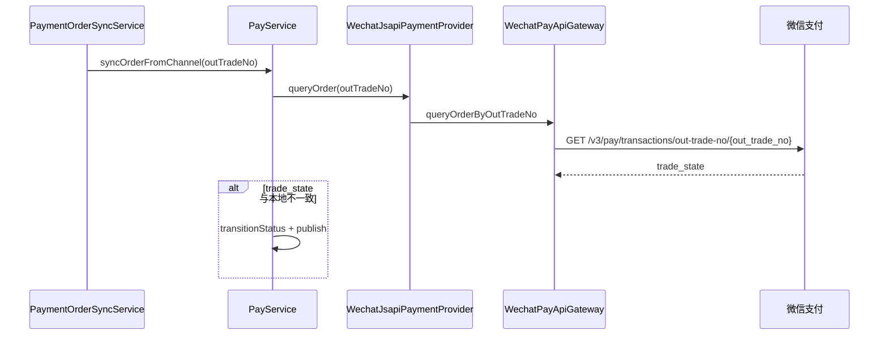

# deadman-plugin-pay-wechat

微信支付渠道插件，实现 [deadman-plugin-pay](../deadman-plugin-pay/) 的 `PaymentProvider` SPI。

当前已实现：

| Provider ID | 支付方式 | 说明 |
|-------------|----------|------|
| `wechat-jsapi` | 小程序 / 公众号 JSAPI | 已实现 |
| `wechat-native` | 扫码支付 | 配置预留，Provider 待实现 |

> 订单持久化、状态流转、事件发布均由 `deadman-plugin-pay` 统一处理，本模块**不包含**独立订单表。

---

## 目录

- [快速开始](#快速开始)
- [支付流程](#支付流程)
- [模块结构](#模块结构)
- [配置说明](#配置说明)
- [使用方法](#使用方法)
- [Mock 模式](#mock-模式)
- [安全与回调](#安全与回调)

---

## 快速开始

### 1. 引入依赖

```xml
<dependency>
    <groupId>com.mtfm</groupId>
    <artifactId>deadman-plugin-pay</artifactId>
</dependency>
<dependency>
    <groupId>com.mtfm</groupId>
    <artifactId>deadman-plugin-pay-wechat</artifactId>
</dependency>
```

### 2. 启用 JSAPI Provider

```yaml
deadman:
  plugin:
    pay:
      enabled: true
      default-provider: wechat-jsapi
    pay-wechat:
      enabled: true
      mock-enabled: true          # 开发环境可先用 Mock
      providers:
        wechat-jsapi:
          enabled: true
          app-id: wx_your_app_id
          notify-url: https://your-domain.example.com/client/api/pay/wechat/jsapi/notify
```

### 3. 业务层发起支付

```java
PaymentPrepayResult result = payService.createPrepay(
        PaymentPrepayContext.builder()
                .bizOrderNo("BIZ20260623001")
                .description("会员月卡")
                .amountTotal(9900)
                .payerUserId(userId)
                .channelParams(Map.of(WechatPayChannelParams.OPENID, openid))
                .build(),
        "wechat-jsapi");

// 返回小程序 wx.requestPayment 所需参数
PaymentClientInvokeParams params = result.clientInvokeParams();
```

---

## 支付流程

### JSAPI 端到端流程



### 预下单时序



### 回调时序



### 主动查单



---

## 模块结构

```
deadman-plugin-pay-wechat/
├── autoconfigure/       DeadmanWechatPayPluginAutoConfiguration
├── client/
│   ├── WechatPayApiGateway          SPI 网关接口
│   ├── WechatPayApiGatewayImpl      真实 APIv3 实现
│   └── MockWechatPayApiGateway      Mock 实现
├── config/
│   ├── WechatPayPluginProperties           商户级配置
│   ├── WechatPayProviderBindingProperties  Provider 级配置
│   └── WechatPaySecurityConfiguration      回调 endpoint 放行
├── controller/
│   └── WechatJsapiPayNotifyController      JSAPI 回调入口
├── provider/
│   └── WechatJsapiPaymentProvider          PaymentProvider 实现
└── constant/
    ├── WechatPayProviderIds                Provider 标识常量
    └── WechatPayChannelParams              渠道参数键（openid）
```

---

## 配置说明

配置前缀：`deadman.plugin.pay-wechat`

### 商户级配置（所有 Provider 共享）

| 配置项 | 类型 | 默认值 | 说明 |
|--------|------|--------|------|
| `enabled` | boolean | `false` | 是否启用微信支付插件 |
| `mock-enabled` | boolean | `true` | 是否使用 Mock 网关 |
| `mch-id` | string | — | 微信支付商户号 |
| `api-v3-key` | string | — | APIv3 密钥 |
| `merchant-serial-no` | string | — | 商户 API 证书序列号 |
| `private-key-path` | string | — | 商户 API 私钥 PEM 文件路径 |

> 当 `mock-enabled=true`，或上述商户凭证任一缺失时，自动使用 Mock 网关。

### Provider 级配置 `providers.<providerId>.*`

以 `wechat-jsapi` 为例：

| 配置项 | 类型 | 默认值 | 说明 |
|--------|------|--------|------|
| `providers.wechat-jsapi.enabled` | boolean | `false` | 是否启用该 Provider |
| `providers.wechat-jsapi.app-id` | string | — | 该 Provider 对应的微信 AppId |
| `providers.wechat-jsapi.notify-url` | string | — | 提交给微信 API 的回调完整 URL |
| `providers.wechat-jsapi.notify-endpoint` | string | `/client/api/pay/wechat/jsapi/notify` | 本应用接收回调的路径 |

> 小程序、Native 扫码等同商户号但 **AppId 不同**，因此按 Provider 独立配置 `app-id` 与 `notify-url`。

### 完整示例（生产）

```yaml
deadman:
  plugin:
    pay:
      enabled: true
      default-provider: wechat-jsapi
    pay-wechat:
      enabled: true
      mock-enabled: false
      mch-id: ${WECHAT_PAY_MCH_ID}
      api-v3-key: ${WECHAT_PAY_API_V3_KEY}
      merchant-serial-no: ${WECHAT_PAY_SERIAL_NO}
      private-key-path: ${WECHAT_PAY_PRIVATE_KEY_PATH}
      providers:
        wechat-jsapi:
          enabled: true
          app-id: ${WECHAT_PAY_JSAPI_APP_ID}
          notify-endpoint: /client/api/pay/wechat/jsapi/notify
          notify-url: https://api.example.com/client/api/pay/wechat/jsapi/notify
        wechat-native:
          enabled: false
          app-id: ${WECHAT_PAY_NATIVE_APP_ID}
          notify-endpoint: /client/api/pay/wechat/native/notify
          notify-url: https://api.example.com/client/api/pay/wechat/native/notify
```

### 环境变量对照

| 环境变量 | 说明 |
|----------|------|
| `DEADMAN_PLUGIN_PAY_WECHAT_ENABLED` | 插件总开关 |
| `DEADMAN_PLUGIN_PAY_WECHAT_MOCK_ENABLED` | Mock 开关 |
| `WECHAT_PAY_MCH_ID` | 商户号 |
| `WECHAT_PAY_API_V3_KEY` | APIv3 密钥 |
| `WECHAT_PAY_SERIAL_NO` | 证书序列号 |
| `WECHAT_PAY_PRIVATE_KEY_PATH` | 私钥路径 |
| `DEADMAN_PLUGIN_PAY_WECHAT_JSAPI_ENABLED` | JSAPI Provider 开关 |
| `WECHAT_PAY_JSAPI_APP_ID` | JSAPI AppId |
| `WECHAT_PAY_JSAPI_NOTIFY_URL` | JSAPI 回调 URL（提交给微信） |
| `WECHAT_PAY_JSAPI_NOTIFY_ENDPOINT` | JSAPI 本应用回调路径 |

---

## 使用方法

### 发起 JSAPI 预下单

```java
import com.mtfm.deadman.plugin.pay.wechat.constant.WechatPayChannelParams;

PaymentPrepayResult result = payService.createPrepay(
        PaymentPrepayContext.builder()
                .bizOrderNo(bizOrder.getOrderNo())
                .description("会员月卡")
                .amountTotal(9900)
                .payerUserId(currentUserId)
                .channelParams(Map.of(
                        WechatPayChannelParams.OPENID, wechatOpenid))
                .build(),
        "wechat-jsapi");
```

**必填渠道参数**

| 参数键 | 说明 |
|--------|------|
| `openid`（`WechatPayChannelParams.OPENID`） | 付款人在当前 AppId 下的 openid |

### 小程序调起支付

`result.clientInvokeParams()` 返回以下字段，直接传给 `wx.requestPayment`：

| 字段 | 微信参数名 |
|------|-----------|
| `timeStamp` | `timeStamp` |
| `nonceStr` | `nonceStr` |
| `packageValue` | `package` |
| `signType` | `signType` |
| `paySign` | `paySign` |

### 监听支付结果

支付回调由 `WechatJsapiPayNotifyController` 接收并委托 `PayService.handleNotify`，业务层只需监听事件：

```java
@EventListener
public void onWechatPaid(PaymentOrderStatusChangedEvent event) {
    if (!"wechat-jsapi".equals(event.order().getProviderId())) {
        return;
    }
    if ("SUCCESS".equals(event.currentStatus())) {
        orderService.markPaid(event.order().getBizOrderNo());
    }
}
```

### 回调 endpoint

| Provider | 默认路径 |
|----------|----------|
| `wechat-jsapi` | `POST /client/api/pay/wechat/jsapi/notify` |
| `wechat-native` | `POST /client/api/pay/wechat/native/notify` |

回调响应遵循微信 APIv3 协议（`{"code":"SUCCESS"}`），**不使用**项目统一 `Result` 封装。

---

## Mock 模式

开发 / 测试环境无需真实商户号：

```yaml
deadman:
  plugin:
    pay-wechat:
      enabled: true
      mock-enabled: true
      providers:
        wechat-jsapi:
          enabled: true
          app-id: test_app_id
          notify-url: https://example.com/client/api/pay/wechat/jsapi/notify
```

Mock 行为：

| 场景 | 行为 |
|------|------|
| 预下单 | 返回 mock `prepay_id` 与调起参数 |
| 回调 | 接受简化 JSON：`{"out_trade_no":"...","transaction_id":"...","trade_state":"SUCCESS"}` |
| 查单 | 单号含 `PAID` 返回 SUCCESS，否则返回 NOTPAY |

---

## 安全与回调

`WechatPaySecurityConfiguration` 会自动放行所有已启用 Provider 的 `notify-endpoint`（仅 `POST`），无需在业务 Security 链中手动配置。

启用条件：

- `deadman.plugin.pay-wechat.enabled=true`
- 对应 Provider 的 `providers.<id>.enabled=true`

---

## 微信 trade_state 映射

| 微信 trade_state | 平台 status |
|------------------|-------------|
| `SUCCESS` | `SUCCESS` |
| `NOTPAY` / `USERPAYING` | `NOT_PAY` |
| `CLOSED` / `REVOKED` / `PAYERROR` | `CLOSED` |
| `REFUND` | `REFUND` |

---

## 相关模块

| 模块 | 说明 |
|------|------|
| [deadman-plugin-pay](../deadman-plugin-pay/) | 支付主体：订单、编排、事件 |
| [plugins/README.md](../README.md) | 插件总览 |
