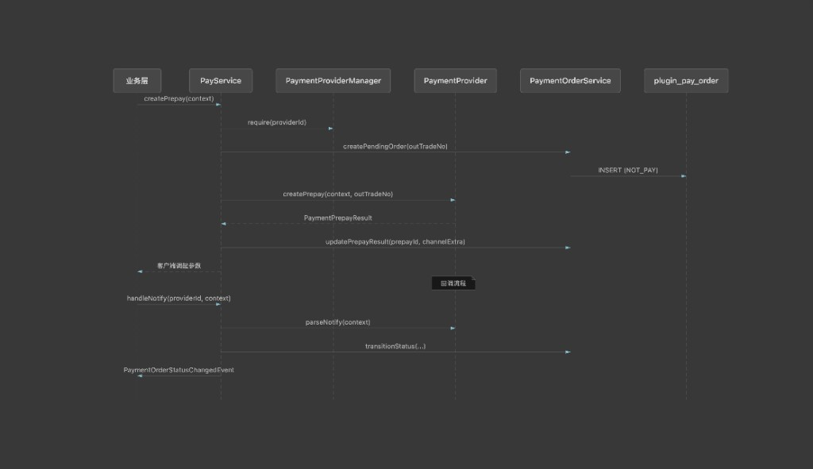

# deadman-plugin-pay

支付能力主体模块，通过 **`PaymentProvider` SPI** 插件化扩展各支付渠道（类比 `deadman-plugin-file` + `FileStorageProvider`）。

本模块负责**统一订单持久化与流程编排**；各渠道插件（如 `deadman-plugin-pay-wechat`）仅实现渠道 API 调用与回调解析，**不得自行持久化支付单**。

## 设计原则

| 层级 | 职责 |
|------|------|
| **业务层** | 创建业务订单、发起支付、监听支付结果事件、更新业务订单状态 |
| **deadman-plugin-pay（本模块）** | 统一 `PaymentOrder` 持久化、`PayService` 流程编排、状态流转、事件发布 |
| **渠道插件（如 pay-wechat）** | 实现 `PaymentProvider`：预下单 API、回调验签与解析 |

核心约束：

- 平台支付单号（`out_trade_no`）由上层 `PayService` 统一生成，传入 Provider
- 订单表 `plugin_pay_order` 记录所有支付平台与支付方式，不区分渠道各自建表
- 查单从统一订单表读取，不依赖 Provider 本地存储

## 架构图

### 支付全流程时序

预下单与回调两条链路由 `PayService` 统一编排，订单持久化集中在 `PaymentOrderService` → `plugin_pay_order`：



| 阶段 | 入口 | 关键步骤 |
|------|------|----------|
| **预下单** | `PayService.createPrepay` | 选 Provider → 写待支付单 → 调渠道 API → 回写 prepay 信息 → 返回客户端调起参数 |
| **回调** | `PayService.handleNotify` | Provider 解析回调 → 更新订单状态 → 发布 `PaymentOrderStatusChangedEvent` |
| **主动查单** | `PayService.syncOrderFromChannel` / `PaymentOrderSyncService` | 回调超时 → 向渠道查单 → 同步状态 → 发布事件 |

### 组件关系

```mermaid
flowchart LR
    subgraph 业务层
        B1[业务 Service]
        B2[@EventListener]
    end

    subgraph deadman-plugin-pay
        PS[PayService]
        POM[PaymentProviderManager]
        POS[PaymentOrderService]
        PO[(plugin_pay_order)]
    end

    subgraph 渠道插件
        P1[wechat-jsapi]
        P2[alipay-app ...]
    end

    B1 --> PS
    PS --> POM
    PS --> POS
    POS --> PO
    POM --> P1
    POM --> P2
    PS -.->|PaymentOrderStatusChangedEvent| B2
```

## 模块结构

```
deadman-plugin-pay/
├── constant/          # PaymentPlatform、PaymentMethod、PaymentOrderStatus
├── entity/            # PaymentOrder
├── mapper/            # PaymentOrderMapper
├── manager/           # PaymentProviderManager
├── service/
│   ├── PayService                 # 统一门面，编排完整支付流程
│   ├── PaymentOrderService        # 订单 CRUD 与状态流转
│   └── PaymentOrderSyncService    # 主动查单业务（与定时触发解耦）
├── scheduler/
│   └── PaymentOrderSyncScheduler  # 内置 Spring 定时触发（可关闭）
├── spi/
│   ├── PaymentProvider            # 渠道 SPI
│   ├── PaymentOutTradeNoSupplier  # 平台支付单号生成 SPI（可覆盖）
│   ├── PaymentPrepayContext       # 预下单入参
│   ├── PaymentPrepayResult        # 预下单出参
│   ├── PaymentOrderSnapshot       # 查单快照
│   ├── PaymentNotifyContext       # 回调入参
│   ├── PaymentNotifyResult        # 回调解析结果
│   └── PaymentQueryResult         # 渠道查单结果
├── event/
│   └── PaymentOrderStatusChangedEvent
├── util/
│   └── PaymentOutTradeNoGenerator
└── resources/db/pay/
    ├── schema.sql             # MySQL DDL
    └── schema-h2.sql          # H2 集成测试 DDL
docs/
└── pay-flow-sequence.png      # 支付全流程时序图
```

## 统一订单表

表名：`plugin_pay_order`（DDL 见 `src/main/resources/db/pay/schema.sql`）

| 字段 | 说明 |
|------|------|
| `out_trade_no` | 平台支付单号，全局唯一 |
| `biz_order_no` | 业务订单号 |
| `amount_total` | 订单金额（分） |
| `status` | `NOT_PAY` / `SUCCESS` / `CLOSED` / `REFUND` |
| `pay_platform` | 支付平台：`WECHAT`、`ALIPAY` 等 |
| `pay_method` | 支付方式：`JSAPI`、`NATIVE`、`APP`、`H5` 等 |
| `provider_id` | Provider 标识，如 `wechat-jsapi` |
| `channel_prepay_id` | 渠道预支付 ID（如微信 `prepay_id`） |
| `channel_transaction_id` | 渠道支付单号（如微信 `transaction_id`） |
| `channel_extra` | 渠道扩展信息 JSON（如 `{"openid":"..."}` ） |
| `payer_user_id` | 付款人用户 ID（业务侧） |
| `notify_raw` | 最近一次回调原文 |

## PaymentOutTradeNoSupplier SPI

平台支付单号（`out_trade_no`）由 `PaymentOutTradeNoSupplier` 生成，默认实现格式为 `PO + yyyyMMddHHmmss + 6 位随机数`。宿主应用可声明自定义 Bean 覆盖：

```java
@Bean
public PaymentOutTradeNoSupplier paymentOutTradeNoSupplier() {
    return (context, provider) -> "BIZ_" + context.getBizOrderNo() + "_" + System.currentTimeMillis();
}
```

自定义实现需注意：

- 单号需**全局唯一**，避免与已有支付单冲突
- 需符合目标支付渠道的长度与字符限制（如微信 `out_trade_no` 最长 32 字符）

## PaymentProvider SPI

各支付渠道插件实现此接口并注册为 Spring Bean：

```java
public interface PaymentProvider {

    String providerId();    // 全局唯一，如 wechat-jsapi
    String payPlatform();   // 如 WECHAT
    String payMethod();     // 如 JSAPI

    // 调用渠道预下单 API，outTradeNo 由上层传入，不得自行持久化
    PaymentPrepayResult createPrepay(PaymentPrepayContext context, String outTradeNo);

    // 解析渠道回调，返回标准化结果
    PaymentNotifyResult parseNotify(PaymentNotifyContext context);

    // 主动向渠道查单，返回标准化结果
    PaymentQueryResult queryOrder(String outTradeNo);
}
```

## PayService 门面 API

| 方法 | 说明 |
|------|------|
| `createPrepay(context)` | 使用默认 Provider 创建预下单 |
| `createPrepay(context, providerId)` | 指定 Provider 创建预下单 |
| `queryOrder(outTradeNo)` | 从统一订单表查询支付单快照 |
| `handleNotify(providerId, context)` | 处理支付回调：解析 → 改状态 → 发事件 |
| `syncOrderFromChannel(outTradeNo)` | 主动向渠道查单并同步本地状态 |
| `listProviders()` | 列出已注册的 Provider 标识 |

## 主动查单（回调补偿）

回调延迟或丢失时，由 `PaymentOrderSyncService` 扫描待支付单并调用 `PayService.syncOrderFromChannel` 向渠道查单。**业务逻辑与定时触发分离**：

| 组件 | 职责 |
|------|------|
| `PaymentOrderSyncService` | 扫描符合条件的 `NOT_PAY` 订单、单笔/批量同步 |
| `PaymentOrderSyncScheduler` | 内置 Spring `@Scheduled` 触发（可通过配置关闭） |

扫描条件（可配置）：

- 状态为 `NOT_PAY`
- 创建时间在 `[now - maxAge, now - minAge]` 窗口内（默认：预下单 2 分钟后开始查，30 分钟内持续查）
- 单次最多处理 `batchSize` 笔

### 关闭内置定时，接入外部调度

```yaml
deadman:
  plugin:
    pay:
      sync:
        scheduler-enabled: false   # 关闭 Spring 内置定时
```

关闭后 `PaymentOrderSyncService` 仍可用，在 XXL-Job / Quartz 等任务中调用：

```java
@Autowired
private PaymentOrderSyncService paymentOrderSyncService;

// 批量扫描
paymentOrderSyncService.syncPendingOrders();

// 或单笔补偿
paymentOrderSyncService.syncOrder("PO20260622120000123456");
```

## 配置

```yaml
deadman:
  plugin:
    pay:
      enabled: true
      default-provider: wechat-jsapi   # 默认支付 Provider
      sync:
        scheduler-enabled: true        # 是否启用内置 Spring 定时查单
        cron: "0 * * * * ?"              # 每分钟扫描一次
        min-age: 2m                      # 预下单后至少等待 2 分钟再查
        max-age: 30m                     # 超过 30 分钟的待支付单不再查
        batch-size: 50                   # 单次扫描上限
```

## 业务层接入

### 发起支付

```java
@Autowired
private PayService payService;

PaymentPrepayResult result = payService.createPrepay(
        PaymentPrepayContext.builder()
                .bizOrderNo(order.getOrderNo())
                .description("会员月卡")
                .amountTotal(9900)
                .payerUserId(userId)
                .channelParams(Map.of("openid", openid))   // 渠道扩展参数
                .build(),
        "wechat-jsapi");

// result.clientInvokeParams() → 小程序 wx.requestPayment 参数
// result.outTradeNo()    → 平台支付单号，可用于查单
```

### 监听支付结果

```java
@EventListener
public void onPaymentStatusChanged(PaymentOrderStatusChangedEvent event) {
    if ("SUCCESS".equals(event.currentStatus())) {
        PaymentOrder order = event.order();
        // 根据 order.getBizOrderNo() 更新业务订单状态
    }
}
```

### 处理支付回调（渠道 Controller 由 pay-wechat 插件提供）

微信 JSAPI 回调 endpoint 示例：`POST /client/api/pay/wechat/jsapi/notify`，由 `WechatJsapiPayNotifyController` 接收后委托 `PayService.handleNotify("wechat-jsapi", ...)`。

## 扩展新支付渠道

1. 新建 Maven 模块（如 `deadman-plugin-pay-alipay`），依赖 `deadman-plugin-pay`
2. 实现 `PaymentProvider`，声明 `payPlatform()` / `payMethod()` / `providerId()`
3. `createPrepay` 仅调用渠道 API，通过 `PaymentPrepayResult.channelExtra()` 回传渠道特有字段
4. `parseNotify` 完成验签与标准化解析
5. 在 `deadman-app/pom.xml` 中引入新模块依赖

**禁止**：在渠道插件中创建独立的支付订单表或 Mapper。

## 依赖

- `deadman-common` — 统一异常与错误码
- `deadman-core` — MyBatis-Plus、Jackson 等基础设施
- MyBatis-Plus — `PaymentOrder` 持久化

## 相关模块

| 模块 | 说明 |
|------|------|
| [deadman-plugin-pay-wechat](../deadman-plugin-pay-wechat/) | 微信 JSAPI 支付 Provider（`wechat-jsapi`） |
